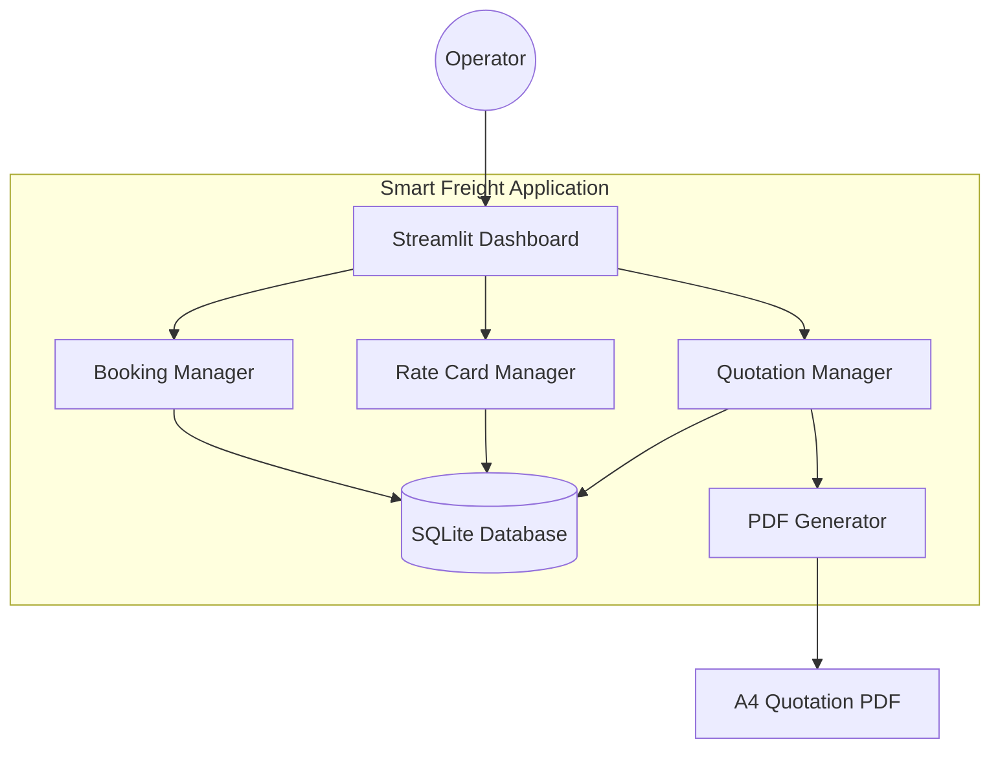
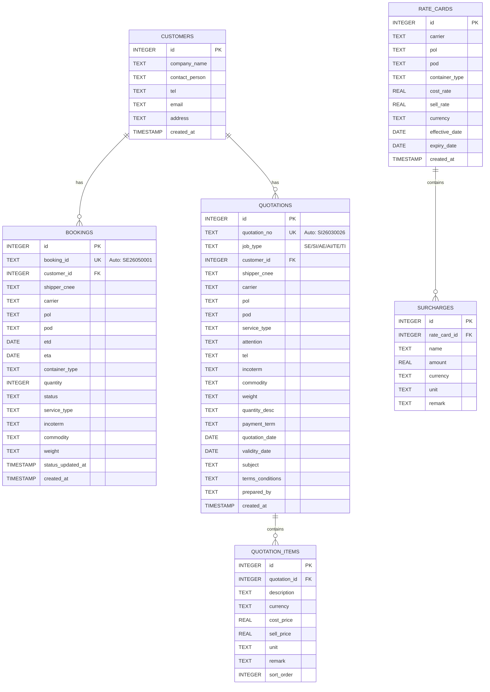
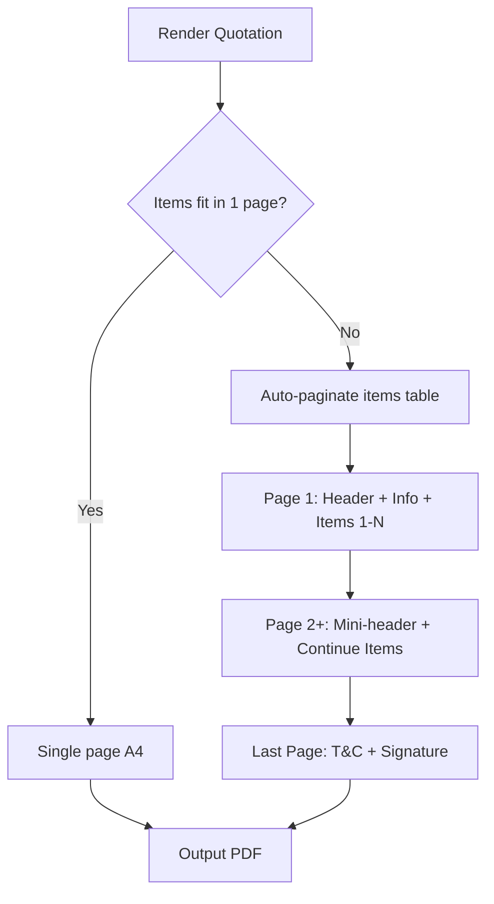
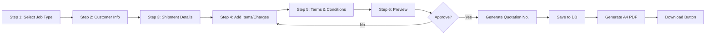
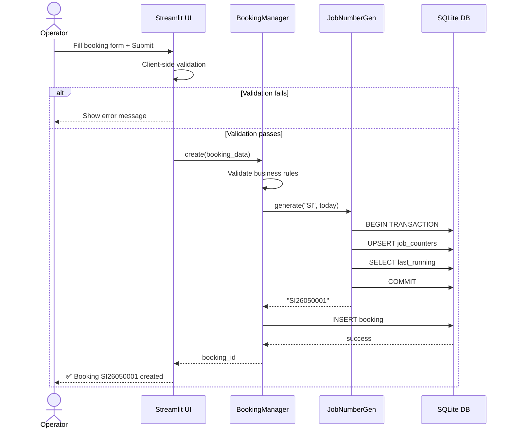
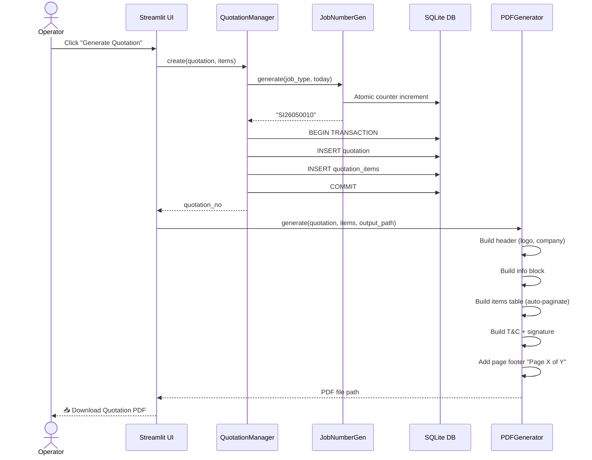

# Technical Design Document — Smart Freight Phase 1

## 1. Architecture Overview

ระบบ Smart Freight Phase 1 ใช้สถาปัตยกรรมแบบ **Monolithic Single-Process** ประกอบด้วย:

- **Frontend**: Python Streamlit (Web Dashboard + Quotation PDF Generator)
- **Backend Logic**: Python modules (Managers)
- **Database**: SQLite (single file, local)
- **PDF Output**: ReportLab / WeasyPrint สำหรับสร้างใบเสนอราคา A4



---

## 2. Technology Stack

| Component | Technology | Version |
|-----------|-----------|---------|
| Language | Python | 3.11+ |
| Web Framework | Streamlit | 1.38+ |
| Database | SQLite3 | Built-in |
| Data Processing | Pandas | 2.x |
| PDF Generation | ReportLab | 4.x |
| Date Handling | datetime (stdlib) | Built-in |
| Testing | pytest | 8.x |

---

## 3. Project Structure

```
smart-freight-ntt/
├── app.py                      # Streamlit entry point
├── requirements.txt            # Python dependencies
├── config.py                   # App configuration (DB path, company info)
├── database/
│   ├── __init__.py
│   ├── connection.py           # SQLite connection & initialization
│   └── schema.sql              # DDL statements
├── managers/
│   ├── __init__.py
│   ├── booking_manager.py      # Booking CRUD
│   ├── rate_manager.py         # Rate Card + Surcharge CRUD
│   ├── quotation_manager.py    # Quotation CRUD + Job No. generation
│   └── customer_manager.py     # Customer master data
├── models/
│   ├── __init__.py
│   ├── booking.py              # Booking dataclass
│   ├── rate_card.py            # RateCard + Surcharge dataclass
│   ├── quotation.py            # Quotation dataclass
│   └── customer.py             # Customer dataclass
├── pages/
│   ├── 1_📦_Bookings.py        # Booking management page
│   ├── 2_💰_Rate_Cards.py      # Rate Card management page
│   ├── 3_📄_Quotations.py      # Quotation creation & list page
│   └── 4_👥_Customers.py       # Customer management page
├── pdf/
│   ├── __init__.py
│   ├── quotation_pdf.py        # A4 PDF generator for quotation
│   └── templates/
│       └── company_logo.png    # Company logo
├── data/
│   └── smart_freight.db        # SQLite database file (auto-created)
└── tests/
    ├── test_booking_manager.py
    ├── test_rate_manager.py
    └── test_quotation_manager.py
```

---

## 4. Database Schema (ER Diagram)



---

## 5. Job Number / Quotation Number Generation

### รูปแบบ: `{JOB_TYPE}{YY}{MM}{RUNNING_4_DIGITS}`

| Job Type | ความหมาย | ตัวอย่าง |
|----------|----------|----------|
| SE | Sea Export | SE26030026 |
| SI | Sea Import | SI26050004 |
| AE | Air Export | AE26030029 |
| AI | Air Import | AI26030001 |
| TE | Truck Export | TE26040001 |
| TI | Truck Import | TI26040074 |

### Logic:
```python
def generate_job_number(job_type: str, date: datetime) -> str:
    """
    Generate: {TYPE}{YY}{MM}{4-digit running}
    Example: SI26030026
    - YY = last 2 digits of Buddhist year (พ.ศ.) = CE year + 543 - 2500
      e.g., 2026 -> 2569 -> 69? NO — based on sample data: 2026 -> "26"
      Actually from samples: 3/3/26 means March 3, 2026 -> "26"
    - MM = 2-digit month
    - Running = sequential per job_type per month, zero-padded 4 digits
    """
    yy = str(date.year)[-2:]  # "26" for 2026
    mm = f"{date.month:02d}"  # "03" for March
    
    # Query max running number for this type+year+month
    last_num = get_last_running(job_type, yy, mm)
    next_num = last_num + 1
    
    return f"{job_type}{yy}{mm}{next_num:04d}"
```

---

## 6. Quotation PDF Design (A4 Layout)

### Page Layout Specifications:
- **Paper Size**: A4 (210mm x 297mm)
- **Margins**: Top 15mm, Bottom 20mm, Left 15mm, Right 15mm
- **Font**: TH Sarabun New (Thai) / Arial (English)
- **Font Sizes**: Header 16pt, Body 11pt, Footer 9pt

### A4 Page Structure:

```
┌─────────────────────────────────────────────────────┐
│  [LOGO]   Nattayaraat Co., Ltd.                     │ ← Header (25mm)
│           Address / Tel / Email / Tax ID            │
├─────────────────────────────────────────────────────┤
│                  QUOTATION                          │ ← Title (10mm)
├─────────────────────────────────────────────────────┤
│  Customer: ___________     │  No.      : SI26030026 │
│  Shpr/Cnee: __________     │  Date     : 03-MAR-2026│ ← Info Block (35mm)
│  Carrier:  ___________     │  Validity : 31-MAR-2026│   2-column layout
│  POL:      ___________     │  Payment  : 30 Days    │
│  POD:      ___________     │  Service  : CY/CY      │
│  Attention:___________     │  Commodity: Gen Cargo  │
│  Tel:      ___________     │  Weight   : 26 Tons    │
│  Incoterm: ___________     │  Quantity : 150x40'    │
├─────────────────────────────────────────────────────┤
│  Subject: Sea Import Shipment                       │ ← Subject
├─────────────────────────────────────────────────────┤
│  Thank you for opportunity extended to us...        │ ← Intro
├─────────────────────────────────────────────────────┤
│  DESCRIPTION                                        │
│  ┌────────────────────┬─────┬───────┬─────┬──────┐ │
│  │ ITEM               │CURR │ PRICE │UNIT │REMARK│ │ ← Items Table
│  ├────────────────────┼─────┼───────┼─────┼──────┤ │   (variable height)
│  │ Transportation...  │ USD │   267 │ 40' │      │ │
│  │ Equipment Maint... │ USD │    35 │ 40' │      │ │
│  │ ...                │     │       │     │      │ │
│  └────────────────────┴─────┴───────┴─────┴──────┘ │
├─────────────────────────────────────────────────────┤
│  Terms & Conditions:                                │
│  - Rent/Storage/DEM/DET...                          │ ← T&C
│  - All quoted charges exclusive of 7% VAT           │
│  - ...                                              │
├─────────────────────────────────────────────────────┤
│  Yours sincerely,                                   │
│       [Signature]                                   │ ← Signature
│  Punnarat M. (Spicy)                                │
│  Managing Director                                  │
├─────────────────────────────────────────────────────┤
│           Page 1 of N                               │ ← Footer
└─────────────────────────────────────────────────────┘
```

### Multi-Page Strategy (เกินหน้า A4):



**Pagination Rules:**
- หน้าแรก: Header (logo + company), Customer Info Block, Subject, Items Table
- หน้าถัดไป (ถ้าเกิน): Mini-header (Quotation No. + "Continued") + Items ต่อ
- หน้าสุดท้าย: Items ที่เหลือ + Terms & Conditions + Signature
- Page footer: "Page X of Y" ทุกหน้า
- ใช้ ReportLab `Platypus` framework เพื่อ auto-flow content

---

## 7. Database Schema (DDL)

```sql
-- Customers Table
CREATE TABLE IF NOT EXISTS customers (
    id INTEGER PRIMARY KEY AUTOINCREMENT,
    company_name TEXT NOT NULL,
    contact_person TEXT,
    tel TEXT,
    email TEXT,
    address TEXT,
    tax_id TEXT,
    created_at TIMESTAMP DEFAULT CURRENT_TIMESTAMP
);

-- Bookings Table
CREATE TABLE IF NOT EXISTS bookings (
    id INTEGER PRIMARY KEY AUTOINCREMENT,
    booking_id TEXT UNIQUE NOT NULL,
    customer_id INTEGER REFERENCES customers(id),
    shipper_cnee TEXT,
    carrier TEXT NOT NULL,
    pol TEXT NOT NULL,
    pod TEXT NOT NULL,
    etd DATE NOT NULL,
    eta DATE NOT NULL,
    container_type TEXT NOT NULL CHECK(container_type IN ('20GP','40GP','40HC','40OT','20FR','20OT')),
    quantity INTEGER NOT NULL CHECK(quantity BETWEEN 1 AND 999),
    status TEXT NOT NULL DEFAULT 'Pending' 
        CHECK(status IN ('Pending','Confirmed','Shipped','Arrived','Cancelled')),
    service_type TEXT,
    incoterm TEXT,
    commodity TEXT,
    weight TEXT,
    status_updated_at TIMESTAMP,
    created_at TIMESTAMP DEFAULT CURRENT_TIMESTAMP
);

CREATE INDEX idx_bookings_carrier ON bookings(carrier);
CREATE INDEX idx_bookings_status ON bookings(status);
CREATE INDEX idx_bookings_etd ON bookings(etd);

-- Rate Cards Table
CREATE TABLE IF NOT EXISTS rate_cards (
    id INTEGER PRIMARY KEY AUTOINCREMENT,
    carrier TEXT NOT NULL,
    pol TEXT NOT NULL,
    pod TEXT NOT NULL,
    container_type TEXT NOT NULL,
    cost_rate REAL NOT NULL CHECK(cost_rate > 0),
    sell_rate REAL NOT NULL CHECK(sell_rate > 0),
    currency TEXT NOT NULL DEFAULT 'USD',
    effective_date DATE NOT NULL,
    expiry_date DATE,
    created_at TIMESTAMP DEFAULT CURRENT_TIMESTAMP,
    UNIQUE(carrier, pol, pod, container_type, effective_date)
);

CREATE INDEX idx_rates_carrier ON rate_cards(carrier);
CREATE INDEX idx_rates_container ON rate_cards(container_type);

-- Surcharges Table
CREATE TABLE IF NOT EXISTS surcharges (
    id INTEGER PRIMARY KEY AUTOINCREMENT,
    rate_card_id INTEGER NOT NULL REFERENCES rate_cards(id) ON DELETE CASCADE,
    name TEXT NOT NULL CHECK(length(name) BETWEEN 1 AND 100),
    amount REAL NOT NULL CHECK(amount > 0),
    currency TEXT NOT NULL DEFAULT 'USD',
    unit TEXT,
    remark TEXT
);

-- Quotations Table
CREATE TABLE IF NOT EXISTS quotations (
    id INTEGER PRIMARY KEY AUTOINCREMENT,
    quotation_no TEXT UNIQUE NOT NULL,
    job_type TEXT NOT NULL CHECK(job_type IN ('SE','SI','AE','AI','TE','TI')),
    customer_id INTEGER REFERENCES customers(id),
    shipper_cnee TEXT,
    carrier TEXT,
    pol TEXT,
    pod TEXT,
    service_type TEXT,
    attention TEXT,
    tel TEXT,
    incoterm TEXT,
    commodity TEXT,
    weight TEXT,
    quantity_desc TEXT,
    payment_term TEXT DEFAULT '30 Days',
    quotation_date DATE NOT NULL,
    validity_date DATE NOT NULL,
    subject TEXT,
    terms_conditions TEXT,
    prepared_by TEXT,
    created_at TIMESTAMP DEFAULT CURRENT_TIMESTAMP
);

CREATE INDEX idx_quotations_job_type ON quotations(job_type);
CREATE INDEX idx_quotations_date ON quotations(quotation_date);

-- Quotation Items Table
CREATE TABLE IF NOT EXISTS quotation_items (
    id INTEGER PRIMARY KEY AUTOINCREMENT,
    quotation_id INTEGER NOT NULL REFERENCES quotations(id) ON DELETE CASCADE,
    description TEXT NOT NULL,
    currency TEXT NOT NULL DEFAULT 'USD',
    cost_price REAL,
    sell_price REAL NOT NULL,
    unit TEXT,
    remark TEXT,
    sort_order INTEGER DEFAULT 0
);

-- Job Number Counter Table (for atomic running number)
CREATE TABLE IF NOT EXISTS job_counters (
    job_type TEXT NOT NULL,
    yymm TEXT NOT NULL,
    last_running INTEGER NOT NULL DEFAULT 0,
    PRIMARY KEY (job_type, yymm)
);
```

---

## 8. Component Design

### 8.1 Database Connection Manager (`database/connection.py`)

```python
class DatabaseConnection:
    """Singleton SQLite connection manager with foreign key enforcement."""
    
    def __init__(self, db_path: str):
        self.db_path = db_path
        self._initialize()
    
    def _initialize(self):
        """Create DB file and tables if missing."""
        # Ensures directory exists, creates file, executes schema.sql
        # Enables PRAGMA foreign_keys = ON
    
    def get_connection(self) -> sqlite3.Connection:
        """Returns a new connection (thread-safe per Streamlit session)."""
    
    def execute_schema(self):
        """Run DDL idempotently (CREATE TABLE IF NOT EXISTS)."""
```

### 8.2 Booking Manager (`managers/booking_manager.py`)

```python
class BookingManager:
    def create(self, booking: Booking) -> str:
        """Create new booking, returns generated booking_id."""
        # 1. Validate required fields
        # 2. Validate ETD < ETA
        # 3. Validate Container_Type in allowed list
        # 4. Generate booking_id via JobNumberGenerator
        # 5. INSERT and return id
    
    def get_all(self, carrier: str = None, status: str = None) -> List[Booking]:
        """Retrieve bookings with optional filters."""
    
    def get_by_id(self, booking_id: str) -> Optional[Booking]: ...
    
    def update(self, booking_id: str, updates: dict) -> bool: ...
    
    def update_status(self, booking_id: str, new_status: str) -> bool:
        """Updates status + status_updated_at timestamp (UTC)."""
    
    def delete(self, booking_id: str) -> bool:
        """Deletes booking, blocks if status in ('Shipped','Arrived')."""
```

### 8.3 Rate Manager (`managers/rate_manager.py`)

```python
class RateManager:
    def create_or_update(self, rate: RateCard) -> Tuple[int, bool]:
        """Upsert based on (carrier,pol,pod,container_type,effective_date).
        Returns (rate_id, was_created)."""
    
    def get_all(self, carrier: str = None, container_type: str = None) -> List[RateCard]: ...
    
    def get_by_id(self, rate_id: int) -> Optional[RateCard]: ...
    
    def update(self, rate_id: int, updates: dict) -> bool: ...
    
    def delete(self, rate_id: int) -> bool:
        """Deletes Rate Card + cascades surcharges. 
        Blocks if referenced by any Booking."""
    
    def add_surcharge(self, rate_id: int, surcharge: Surcharge) -> int: ...
    
    def get_surcharges(self, rate_id: int) -> List[Surcharge]: ...
    
    def calculate_margin(self, rate: RateCard) -> Optional[float]:
        """Returns sell - cost, or None if either is missing."""
```

### 8.4 Quotation Manager (`managers/quotation_manager.py`)

```python
class QuotationManager:
    def create(self, quotation: Quotation, items: List[QuotationItem]) -> str:
        """Create quotation with items. Returns quotation_no."""
        # 1. Generate quotation_no via JobNumberGenerator (atomic)
        # 2. Insert quotation
        # 3. Insert all items
        # 4. Commit transaction
    
    def get_all(self, job_type: str = None, customer_id: int = None) -> List[Quotation]: ...
    
    def get_by_no(self, quotation_no: str) -> Optional[Quotation]: ...
    
    def get_items(self, quotation_id: int) -> List[QuotationItem]: ...
    
    def update(self, quotation_no: str, updates: dict) -> bool: ...
    
    def delete(self, quotation_no: str) -> bool: ...
    
    def duplicate(self, quotation_no: str) -> str:
        """Clone existing quotation with new quotation_no."""
```

### 8.5 Job Number Generator (`managers/job_number.py`)

```python
class JobNumberGenerator:
    """Atomic job number generator with per-month running counter."""
    
    JOB_TYPES = {
        'SE': 'Sea Export',
        'SI': 'Sea Import',
        'AE': 'Air Export',
        'AI': 'Air Import',
        'TE': 'Truck Export',
        'TI': 'Truck Import',
    }
    
    def generate(self, job_type: str, ref_date: date = None) -> str:
        """
        Atomically generates next job number.
        Format: {TYPE}{YY}{MM}{NNNN}
        Example: SI26030026
        
        Uses UPDATE ... RETURNING (or transaction with SELECT FOR UPDATE)
        on job_counters table to ensure uniqueness under concurrency.
        """
        ref_date = ref_date or date.today()
        yy = f"{ref_date.year % 100:02d}"
        mm = f"{ref_date.month:02d}"
        yymm = f"{yy}{mm}"
        
        # Atomic increment via SQLite transaction
        with conn:
            conn.execute("""
                INSERT INTO job_counters (job_type, yymm, last_running)
                VALUES (?, ?, 1)
                ON CONFLICT (job_type, yymm) DO UPDATE
                SET last_running = last_running + 1
            """, (job_type, yymm))
            
            row = conn.execute("""
                SELECT last_running FROM job_counters
                WHERE job_type=? AND yymm=?
            """, (job_type, yymm)).fetchone()
        
        return f"{job_type}{yymm}{row[0]:04d}"
```

### 8.6 Quotation PDF Generator (`pdf/quotation_pdf.py`)

```python
class QuotationPDFGenerator:
    """Generates A4 PDF for quotation using ReportLab Platypus."""
    
    PAGE_SIZE = A4  # 210 x 297 mm
    MARGINS = dict(top=15*mm, bottom=20*mm, left=15*mm, right=15*mm)
    
    def __init__(self, company_info: dict):
        self.company_info = company_info  # logo, name, address, tax_id
    
    def generate(self, quotation: Quotation, items: List[QuotationItem],
                 output_path: str) -> str:
        """
        Build PDF using SimpleDocTemplate + Platypus flowables.
        Auto-handles multi-page when content overflows.
        """
        doc = SimpleDocTemplate(output_path, pagesize=A4, **self.MARGINS)
        
        story = []
        story.append(self._build_header())              # Logo + Company
        story.append(self._build_title())               # "QUOTATION"
        story.append(self._build_info_block(quotation)) # 2-col customer/quote info
        story.append(self._build_subject(quotation))    # Subject line
        story.append(self._build_intro_text())          # Thank-you paragraph
        story.append(self._build_items_table(items))    # Line items (auto-paginate)
        story.append(self._build_terms(quotation))      # T&C
        story.append(self._build_signature())           # Signature block
        
        doc.build(story, 
                  onFirstPage=self._page_decoration,
                  onLaterPages=self._page_decoration_continued)
        return output_path
    
    def _build_items_table(self, items) -> Table:
        """Creates a Platypus Table that auto-splits across pages.
        Uses repeatRows=1 so header repeats on each page."""
    
    def _page_decoration(self, canvas, doc):
        """Draws page footer 'Page X of Y' on every page."""
```

---

## 9. Data Models (Dataclasses)

### 9.1 Booking Model (`models/booking.py`)

```python
from dataclasses import dataclass
from datetime import date, datetime
from typing import Optional

@dataclass
class Booking:
    booking_id: str
    customer_id: Optional[int]
    shipper_cnee: Optional[str]
    carrier: str
    pol: str
    pod: str
    etd: date
    eta: date
    container_type: str  # 20GP, 40GP, 40HC, 40OT, 20FR, 20OT
    quantity: int
    status: str = 'Pending'
    service_type: Optional[str] = None
    incoterm: Optional[str] = None
    commodity: Optional[str] = None
    weight: Optional[str] = None
    status_updated_at: Optional[datetime] = None
    created_at: Optional[datetime] = None
    id: Optional[int] = None
    
    def validate(self) -> List[str]:
        """Returns list of validation errors."""
        errors = []
        if not self.carrier: errors.append("Carrier is required")
        if not self.pol: errors.append("POL is required")
        if not self.pod: errors.append("POD is required")
        if self.etd >= self.eta: errors.append("ETD must be before ETA")
        if self.quantity < 1 or self.quantity > 999:
            errors.append("Quantity must be between 1 and 999")
        if self.container_type not in ['20GP','40GP','40HC','40OT','20FR','20OT']:
            errors.append("Invalid container type")
        return errors
```

### 9.2 Rate Card Model (`models/rate_card.py`)

```python
@dataclass
class RateCard:
    carrier: str
    pol: str
    pod: str
    container_type: str
    cost_rate: float
    sell_rate: float
    effective_date: date
    currency: str = 'USD'
    expiry_date: Optional[date] = None
    created_at: Optional[datetime] = None
    id: Optional[int] = None
    
    def calculate_margin(self) -> float:
        return self.sell_rate - self.cost_rate
    
    def validate(self) -> List[str]:
        errors = []
        if self.cost_rate <= 0: errors.append("Cost rate must be positive")
        if self.sell_rate <= 0: errors.append("Sell rate must be positive")
        if self.cost_rate > 999_999_999.99: errors.append("Cost rate too large")
        if self.sell_rate > 999_999_999.99: errors.append("Sell rate too large")
        return errors

@dataclass
class Surcharge:
    rate_card_id: int
    name: str
    amount: float
    currency: str = 'USD'
    unit: Optional[str] = None
    remark: Optional[str] = None
    id: Optional[int] = None
    
    def validate(self) -> List[str]:
        errors = []
        if not self.name or len(self.name) > 100:
            errors.append("Name must be 1-100 characters")
        if self.amount <= 0 or self.amount > 999_999.99:
            errors.append("Amount must be between 0.01 and 999,999.99")
        return errors
```

### 9.3 Quotation Model (`models/quotation.py`)

```python
@dataclass
class Quotation:
    quotation_no: str
    job_type: str  # SE, SI, AE, AI, TE, TI
    quotation_date: date
    validity_date: date
    customer_id: Optional[int] = None
    shipper_cnee: Optional[str] = None
    carrier: Optional[str] = None
    pol: Optional[str] = None
    pod: Optional[str] = None
    service_type: Optional[str] = None
    attention: Optional[str] = None
    tel: Optional[str] = None
    incoterm: Optional[str] = None
    commodity: Optional[str] = None
    weight: Optional[str] = None
    quantity_desc: Optional[str] = None
    payment_term: str = '30 Days'
    subject: Optional[str] = None
    terms_conditions: Optional[str] = None
    prepared_by: Optional[str] = None
    created_at: Optional[datetime] = None
    id: Optional[int] = None
    
    def validate(self) -> List[str]:
        errors = []
        if self.job_type not in ['SE','SI','AE','AI','TE','TI']:
            errors.append("Invalid job type")
        if self.quotation_date > self.validity_date:
            errors.append("Quotation date must be before validity date")
        return errors

@dataclass
class QuotationItem:
    quotation_id: int
    description: str
    sell_price: float
    currency: str = 'USD'
    cost_price: Optional[float] = None
    unit: Optional[str] = None
    remark: Optional[str] = None
    sort_order: int = 0
    id: Optional[int] = None
    
    def validate(self) -> List[str]:
        errors = []
        if not self.description:
            errors.append("Description is required")
        if self.sell_price < 0:
            errors.append("Sell price cannot be negative")
        return errors
```

### 9.4 Customer Model (`models/customer.py`)

```python
@dataclass
class Customer:
    company_name: str
    contact_person: Optional[str] = None
    tel: Optional[str] = None
    email: Optional[str] = None
    address: Optional[str] = None
    tax_id: Optional[str] = None
    created_at: Optional[datetime] = None
    id: Optional[int] = None
    
    def validate(self) -> List[str]:
        errors = []
        if not self.company_name:
            errors.append("Company name is required")
        return errors
```

---

## 10. Streamlit UI Design

### 10.1 Main Dashboard (`app.py`)

```python
import streamlit as st
from database.connection import DatabaseConnection
from config import DB_PATH, COMPANY_INFO

# Initialize DB on app start
@st.cache_resource
def init_database():
    return DatabaseConnection(DB_PATH)

def main():
    st.set_page_config(
        page_title="Smart Freight NTT",
        page_icon="🚢",
        layout="wide"
    )
    
    # Initialize DB
    db = init_database()
    
    # Sidebar navigation
    st.sidebar.title("🚢 Smart Freight NTT")
    st.sidebar.markdown("---")
    st.sidebar.info("""
    **Phase 1 Features:**
    - 📦 Booking Management
    - 💰 Rate Card Management
    - 📄 Quotation System
    - 👥 Customer Database
    """)
    
    # Home page content
    st.title("Welcome to Smart Freight Management System")
    
    col1, col2, col3, col4 = st.columns(4)
    with col1:
        st.metric("Total Bookings", get_booking_count())
    with col2:
        st.metric("Active Rate Cards", get_rate_card_count())
    with col3:
        st.metric("Quotations This Month", get_quotation_count())
    with col4:
        st.metric("Customers", get_customer_count())
    
    # Recent activity
    st.subheader("Recent Bookings")
    display_recent_bookings()

if __name__ == "__main__":
    main()
```

### 10.2 Bookings Page (`pages/1_📦_Bookings.py`)

**Layout:**
- Tab 1: View All Bookings (with filters)
- Tab 2: Create New Booking
- Tab 3: Update Booking

**Features:**
- Filter by Carrier, Status, Date Range
- Sortable table with all booking fields
- Edit/Delete buttons per row
- Status update with timestamp tracking
- Validation feedback on form submission

```python
def render_bookings_page():
    st.title("📦 Booking Management")
    
    tab1, tab2, tab3 = st.tabs(["View Bookings", "Create Booking", "Update Booking"])
    
    with tab1:
        # Filters
        col1, col2, col3 = st.columns(3)
        carrier_filter = col1.selectbox("Carrier", ["All"] + get_carriers())
        status_filter = col2.selectbox("Status", ["All"] + BOOKING_STATUSES)
        date_range = col3.date_input("ETD Range", [])
        
        # Display table
        bookings = booking_manager.get_all(
            carrier=None if carrier_filter=="All" else carrier_filter,
            status=None if status_filter=="All" else status_filter
        )
        st.dataframe(bookings, use_container_width=True)
    
    with tab2:
        # Create form with validation
        with st.form("create_booking"):
            # Form fields...
            submitted = st.form_submit_button("Create Booking")
            if submitted:
                # Validate and save
```

### 10.3 Rate Card Page (`pages/2_💰_Rate_Cards.py`)

**Layout:**
- Tab 1: View Rate Cards (filter by Carrier / Container Type)
- Tab 2: Add Rate Card + Surcharges
- Tab 3: Margin Analysis (เปรียบเทียบกำไรระหว่างสายการเรือ)

**Features:**
- ตาราง Rate Card พร้อมคอลัมน์ Margin สีเขียว/แดง
- เพิ่ม Surcharges แบบ dynamic (เพิ่ม/ลบ row ได้)
- Upsert logic: ถ้า Rate Card ซ้ำ → update + แจ้งผู้ใช้
- แสดง Total Cost (Cost + Surcharges) และ Total Sell

### 10.4 Quotations Page (`pages/3_📄_Quotations.py`)

**Layout:**
- Tab 1: List Quotations (search by No., Customer, Date)
- Tab 2: Create New Quotation (Multi-step form)
- Tab 3: Preview & Download PDF

**Create Quotation Workflow:**



**Form Structure:**
```python
def render_create_quotation():
    st.subheader("Create New Quotation")
    
    # Step 1: Job Type Selection
    job_type = st.selectbox(
        "Job Type",
        options=['SE','SI','AE','AI','TE','TI'],
        format_func=lambda x: f"{x} - {JOB_TYPE_LABELS[x]}"
    )
    
    # Step 2: Customer (with autocomplete from DB)
    customer = st.selectbox(
        "Customer",
        options=customer_manager.get_all(),
        format_func=lambda c: c.company_name
    )
    
    # Step 3: Shipment details
    col1, col2 = st.columns(2)
    with col1:
        carrier = st.text_input("Carrier")
        pol = st.text_input("POL (Port of Loading)")
        pod = st.text_input("POD (Port of Discharge)")
        commodity = st.text_input("Commodity")
    with col2:
        service_type = st.selectbox("Service Type", 
            ["CY/CY","CY/CFS","CFS/CY","CFS/CFS","AIR","TRUCK"])
        incoterm = st.selectbox("Incoterm",
            ["FOB","CIF","DAP","DDP","DDU","C&F","EXW"])
        weight = st.text_input("Weight (e.g., 26 Tons / 40')")
        quantity_desc = st.text_input("Quantity (e.g., 150 X 40' per Month)")
    
    # Step 4: Quotation items (dynamic table)
    st.subheader("Quotation Items")
    if 'quotation_items' not in st.session_state:
        st.session_state.quotation_items = [{}]
    
    for i, item in enumerate(st.session_state.quotation_items):
        cols = st.columns([3,1,1,1,1,2,1])
        item['description'] = cols[0].text_input("Description", key=f"desc_{i}")
        item['currency'] = cols[1].selectbox("CURR", ["USD","THB","CNY"], key=f"cur_{i}")
        item['cost_price'] = cols[2].number_input("Cost", key=f"cost_{i}")
        item['sell_price'] = cols[3].number_input("Sell", key=f"sell_{i}")
        item['unit'] = cols[4].text_input("Unit", key=f"unit_{i}")
        item['remark'] = cols[5].text_input("Remark", key=f"rmk_{i}")
        if cols[6].button("🗑️", key=f"del_{i}"):
            st.session_state.quotation_items.pop(i)
            st.rerun()
    
    if st.button("➕ Add Item"):
        st.session_state.quotation_items.append({})
        st.rerun()
    
    # Step 5: Terms & Conditions (default template editable)
    terms = st.text_area("Terms & Conditions", 
                          value=DEFAULT_TERMS, height=300)
    
    # Step 6: Submit
    if st.button("Generate Quotation", type="primary"):
        # Auto-generate quotation_no
        # Save to DB
        # Generate PDF
        # Show download button
        pass
```

---

## 11. Sequence Diagrams

### 11.1 Create Booking Flow



### 11.2 Generate Quotation PDF Flow



---

## 12. Validation Rules Mapping

| Field | Validation Rule | Source Requirement |
|-------|----------------|-------------------|
| Booking.carrier | Non-empty string | Req 2.2, Req 2.4 |
| Booking.pol/pod | Non-empty string | Req 2.2, Req 2.4 |
| Booking.etd vs eta | etd < eta | Req 2.5, Req 4.4 |
| Booking.container_type | In {20GP,40GP,40HC,40OT,20FR,20OT} | Req 2.6 |
| Booking.quantity | 1 ≤ qty ≤ 999 | Req 2.2 |
| Booking.status (delete) | Cannot delete if Shipped/Arrived | Req 5.4 |
| RateCard.cost_rate | 0.01 ≤ value ≤ 999,999,999.99 | Req 6.2, Req 6.4 |
| RateCard.sell_rate | 0.01 ≤ value ≤ 999,999,999.99 | Req 6.2, Req 6.4 |
| RateCard uniqueness | (carrier,pol,pod,ctnr,date) → upsert | Req 6.5 |
| Surcharge.name | 1-100 characters | Req 9.1, Req 9.6 |
| Surcharge.amount | 0.01 ≤ value ≤ 999,999.99 | Req 9.1 |
| Quotation.job_type | In {SE,SI,AE,AI,TE,TI} | New (per user) |
| Quotation.validity_date | ≥ quotation_date | New (per user) |

---
