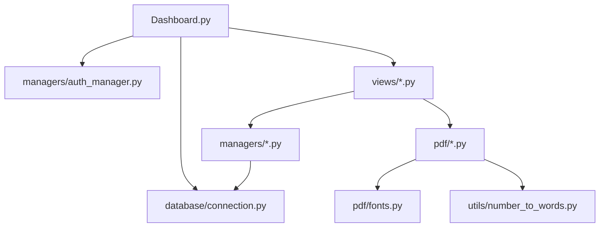
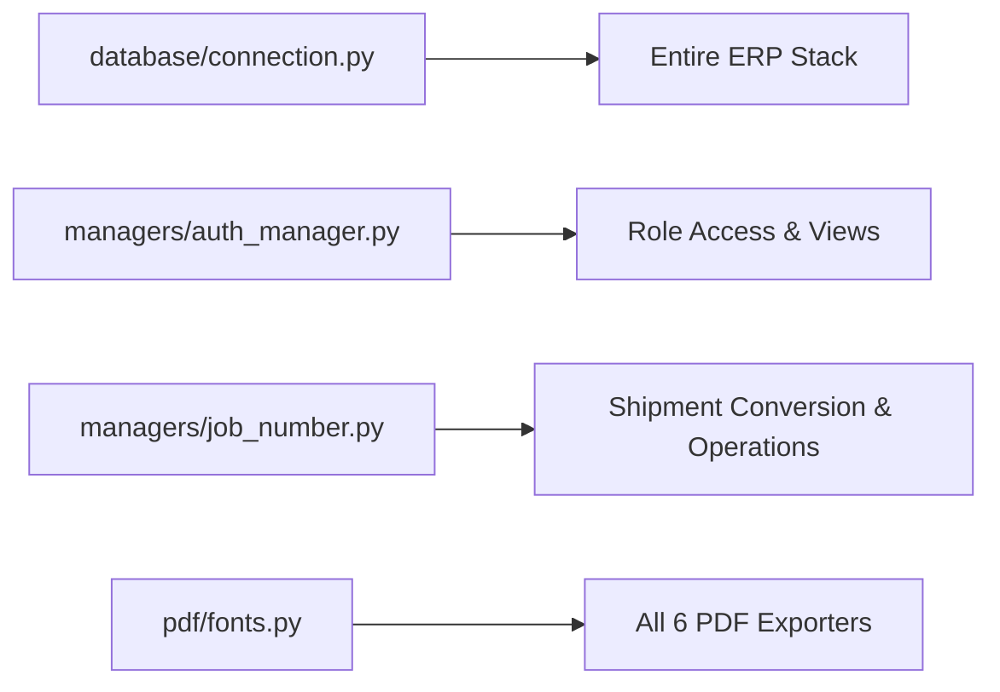

# SYSTEM ARCHITECTURE AUDIT FINAL

> **AUDIT STATUS**: PASS  
> **RULE COMPLIANCE**: 100% AUDIT ONLY — NO SOURCE CODE, DATABASE SCHEMAS, OR BUSINESS LOGIC WERE MODIFIED OR DELETED.

---

## 1. Executive Summary
This document represents the master system architecture audit of the **Smart Freight NTT** platform (branded operationally as **FreightFlow**). The platform is a multi-tenant Freight Forwarding ERP and Operational Control Tower built on Python, Streamlit, ReportLab PDF Exporters, PostgreSQL (Supabase), and automated local SQLite fallback adapters.

The system enforces a strict operational lifecycle:
$$\text{Quotation} \longrightarrow \text{Booking} \longrightarrow \text{JOB NO.} \longrightarrow \text{Shipment Control (Containers / Milestones / B/L / Invoicing)}$$

---

## 2. Actual Repository Structure

```
Smart Freight NTT/
├── Dashboard.py                  # Main Streamlit Application Router & Navigation Hub
├── config.py                     # Global Configuration & Environment Variables
├── database/
│   └── connection.py             # PostgreSQL / SQLite Connection Adapter & DDL Schemas
├── managers/                     # Domain Logic & Business Rules Layer
│   ├── ai_quote_parser.py        # Gemini AI PDF Quotation Parser
│   ├── auth_manager.py           # Bcrypt Auth, Identity & RBAC Matrix
│   ├── billing_manager.py        # AR Tax Invoices & Payment Statuses
│   ├── bl_manager.py             # Master/House Bill of Lading Logic
│   ├── booking_manager.py        # Booking Ledger & Revision History Engine
│   ├── container_manager.py      # Container Tracking & VGM Management
│   ├── customer_manager.py       # CRM Customer Registry
│   ├── dashboard_manager.py      # Control Tower KPIs & Operational Metrics Engine
│   ├── doc_number.py             # Atomic Sequence Generator for Invoices & Quotations
│   ├── email_manager.py          # SMTP Document Transmission Service
│   ├── job_cost_manager.py       # Job P&L (AR Revenue & AP Vendor Costs)
│   ├── job_number.py             # YYMM Atomic Job No. Counter Generator
│   ├── milestone_manager.py      # Milestone Events & Timeline Tracking
│   ├── quotation_manager.py      # Commercial Quotations Engine
│   ├── quotation_number.py       # Legacy Quotation Sequence Helper (Duplicate)
│   ├── session_manager.py        # Session Token Persistence Engine
│   ├── shipment_manager.py       # Master Job Operations Manager
│   ├── template_manager.py       # Legacy Document Templates Helper
│   └── user_manager.py          # Identity Administration Helper
├── views/                        # Streamlit UI Presentation Component Layer
│   ├── billing_view.py           # AR Tax Invoicing Workspace
│   ├── bl_view.py                # Bill of Lading Management Desk
│   ├── booking_view.py           # Booking Manifest Ledger & Revision Workspace
│   ├── booking_pdf_view.py       # Standalone Booking PDF Compiler UI
│   ├── customer_view.py          # CRM Customer Directory UI
│   ├── dashboard_view.py         # Real-Time Operational Control Tower UI
│   ├── finance.py                # Legacy Finance View Prototype (Duplicate)
│   ├── job_cost_view.py          # Job Profitability & Cost Ledger UI
│   ├── login_view.py             # Login & Authentication Workspace UI
│   ├── milestone_view.py         # Milestone Event Tracking UI
│   ├── quotation_view.py         # Commercial Quotation Creator & AI Parser UI
│   ├── settings_view.py          # System Preferences UI
│   ├── shipment_view.py          # Master Job Control Center (10-Tab Desk)
│   ├── tracking_view.py          # Customer Tracking Portal UI
│   └── users_view.py             # User Access & Password Management UI
├── pdf/                          # ReportLab PDF Generation Engines
│   ├── bl_pdf.py                 # Bill of Lading PDF Exporter
│   ├── booking_pdf.py            # Booking Confirmation PDF Exporter
│   ├── fonts.py                  # ReportLab TTF Font Registration Engine
│   ├── invoice_pdf.py            # Tax Invoice PDF Exporter
│   ├── manual_pdf.py             # System Manual PDF Exporter
│   ├── profit_pdf.py             # Job Profit Sheet PDF Exporter
│   └── quote_pdf.py              # Commercial Quotation PDF Exporter
├── utils/                        # System Utility Modules
│   ├── nav.py                    # Navigation Router Helper
│   ├── number_to_words.py        # Legal Thai Baht Text Generator for Invoices
│   └── page_guard.py             # Security Guard Middleware for RBAC
├── contracts/                    # Legacy TypedDict Specifications (Unused)
├── core/                         # Early Core Abstraction Helpers (Unused)
├── repositories/                 # Legacy Repository Pattern Code (Unused)
├── services/                     # Legacy Service Abstraction Layer (Unused)
├── ui/                           # Legacy Prototype UI Scripts (Unused)
├── scripts/                      # Operational & QA Seeding Scripts
│   └── seed_shipments.py         # Mock Data Seeder Script
└── assets/                       # Static Assets & Logo Images
```

---

## 3. Runtime Entry Points
- **Primary Runtime Entry**: [`Dashboard.py`](file:///c:/Users/User/Desktop/Got/Smart%20Freight%20NTT,/Dashboard.py)
  - Initiates Streamlit page config and session state guards.
  - Calls `init_database()` in `database/connection.py`.
  - Invokes `require_auth()` in `utils/page_guard.py` for identity validation.
  - Delegates rendering to active views inside `views/`.

---

## 4. Application Dependency Architecture



---

## 5. View → Manager → Database Map

| View Module | Business Manager | Primary Database Tables |
| :--- | :--- | :--- |
| `login_view.py` | `auth_manager.py`, `session_manager.py` | `users`, `sessions`, `audit_logs` |
| `quotation_view.py` | `quotation_manager.py`, `ai_quote_parser.py` | `quotations` |
| `booking_view.py` | `booking_manager.py` | `bookings`, `booking_revisions`, `quotations` |
| `shipment_view.py` | `shipment_manager.py`, `container_manager.py`, `milestone_manager.py` | `shipments`, `containers`, `shipment_milestones`, `job_counters` |
| `bl_view.py` | `bl_manager.py` | `bills_of_lading`, `bl_containers`, `shipments` |
| `billing_view.py` | `billing_manager.py`, `doc_number.py` | `invoices`, `shipments` |
| `job_cost_view.py` | `job_cost_manager.py` | `job_costs`, `shipments` |
| `dashboard_view.py` | `dashboard_manager.py` | `quotations`, `bookings`, `shipments`, `containers`, `bills_of_lading` |

---

## 6. Database Architecture
Primary Engine: PostgreSQL (Supabase) with SQLite automated fallback adapter (`SQLiteConnAdapter`).

### Tables Index & Primary Keys:
1. `users` (`id` PK AUTOINCREMENT, `username` UNIQUE)
2. `sessions` (`id` PK AUTOINCREMENT, `token` UNIQUE FK `users.id`)
3. `customers` (`id` PK AUTOINCREMENT)
4. `quotations` (`id` PK AUTOINCREMENT, `quotation_no` UNIQUE)
5. `bookings` (`id` PK AUTOINCREMENT, `booking_no` NOT NULL, `job_no` indexed)
6. `booking_revisions` (`id` PK AUTOINCREMENT, `booking_no` NOT NULL)
7. `shipments` (`id` PK AUTOINCREMENT, `job_no` UNIQUE NOT NULL)
8. `job_counters` (`PRIMARY KEY (job_type, yymm)`)
9. `containers` (`id` PK AUTOINCREMENT, `job_no` indexed)
10. `shipment_milestones` (`id` PK AUTOINCREMENT, `shipment_id` FK `shipments.id`)
11. `bills_of_lading` (`id` PK AUTOINCREMENT, `bl_no` UNIQUE, `job_no` indexed)
12. `bl_containers` (`bl_id` FK, `container_id` FK, `PRIMARY KEY(bl_id, container_id)`)
13. `invoices` (`id` PK AUTOINCREMENT, `doc_no` UNIQUE)
14. `job_costs` (`id` PK AUTOINCREMENT, `shipment_id` FK `shipments.id`)
15. `audit_logs` (`id` PK AUTOINCREMENT)

---

## 7. Quotation Architecture
- Implemented in `views/quotation_view.py` and `managers/quotation_manager.py`.
- Integrates Google Gemini AI PDF parser (`ai_quote_parser.py`) for automated quotation line extraction.
- Renders commercial PDFs via `pdf/quote_pdf.py`.

---

## 8. Booking Architecture
- Implemented in `views/booking_view.py` and `managers/booking_manager.py`.
- Displays Booking Ledger with exact columns:
  $$\text{BOOKING NO} \mid \text{REV} \mid \text{CUSTOMER} \mid \text{POL} \mid \text{POD} \mid \text{VESSEL} \mid \text{ETD} \mid \text{ETA} \mid \text{STATUS} \mid \text{JOB NO}$$
- Supports multi-parameter filtering across Booking No, Rev, Customer, POL, POD, Vessel, ETD, ETA, Status, and Job No.

---

## 9. Booking Revision Architecture
- Tracks version history via `revision_no` counter and `booking_revisions` JSON snapshots.
- Logs revision reasons (`revision_reason`) and timestamped operator signatures (`revised_by`).
- Preserves historical records while setting `is_current = 1` on active booking revisions.

---

## 10. Job / Shipment Architecture
- Implemented in `views/shipment_view.py` and `managers/shipment_manager.py`.
- Establishes `JOB NO.` as the primary master operational reference.
- Displays Shipment Ledger with exact columns:
  $$\text{JOB NO} \mid \text{BOOKING NO} \mid \text{CUSTOMER} \mid \text{POL} \mid \text{POD} \mid \text{VESSEL} \mid \text{ETD} \mid \text{ETA} \mid \text{STATUS}$$
- Provides a comprehensive 10-tab Job Workspace: `Overview`, `Parties`, `Routing`, `Vessel / Voyage`, `Cargo`, `Containers`, `Milestones`, `Documents / B/L`, `Commercial`, `Audit / History`.

---

## 11. Container Architecture
- Implemented in `managers/container_manager.py`.
- Manages container numbers, sizes (`20GP`, `40GP`, `40HC`, `45HC`, `LCL`), types (`GP`, `HQ`, `RF`, `OT`, `FR`, `TK`), seal numbers, VGM (kg), tare weight, gross weight, and container status.

---

## 12. Milestone Architecture
- Implemented in `managers/milestone_manager.py`.
- Tracks event timelines (`Booking Confirmed`, `Container Picked Up`, `Gated In POL`, `Vessel Departed`, `Arrived POD`, `Customs Cleared`, `Delivered`).

---

## 13. B/L Architecture
- Implemented in `views/bl_view.py` and `managers/bl_manager.py`.
- Supports Ocean Bill of Lading (Master B/L and House B/L).
- Connects containers dynamically to B/Ls via `bl_containers` junction.

---

## 14. PDF Architecture
- Built on ReportLab engine with dynamic THSarabunNew TTF font loading (`pdf/fonts.py`).
- 6 active exporters:
  - `quote_pdf.py` (Quotation PDF)
  - `booking_pdf.py` (Booking Confirmation PDF)
  - `bl_pdf.py` (Bill of Lading PDF)
  - `invoice_pdf.py` (Tax Invoice PDF with legal Baht text)
  - `profit_pdf.py` (Job Profitability Sheet PDF)
  - `manual_pdf.py` (User Manual Documentation PDF)

---

## 15. Dashboard Architecture
- Implemented in `views/dashboard_view.py` and `managers/dashboard_manager.py`.
- Serves as a real-time Operational Logistics Control Tower displaying:
  - Module Volume KPIs (Quotations, Bookings, Jobs, Containers, B/Ls)
  - Date Control & Schedule Monitoring (ETD/ETA today, next 7 days, next 14 days, overdue ETA alerts)
  - Exception & Bottleneck Monitoring (Confirmed Booking w/o Job, Jobs w/o Containers, Jobs w/o B/L, Missing Dates)

---

## 16. Authentication & RBAC
- Implemented in `managers/auth_manager.py` and `utils/page_guard.py`.
- Uses `bcrypt` password hashing and session tokens in `sessions` table.
- RBAC permissions matrix supports 4 roles: `admin`, `sales`, `operation`, `accounting`.

---

## 17. Actual End-to-End Workflow

```
CUSTOMER REGISTRY (CRM)
          ↓
COMMERCIAL QUOTATION (Active -> Converted)
          ↓
FREIGHT BOOKING (Proceed -> Confirmed -> Revision Control)
          ↓
JOB CONVERSION (Status: Confirmed -> Converted_to_Job; Generates JOB NO.)
          ↓
JOB OPERATION CONTROL DESK (Routing, Vessel/Voyage, Cargo)
          ├── Containers (Sizes, Types, VGM kg)
          ├── Milestones (Timeline tracking)
          ├── Bill of Lading (Master/House B/L & PDF Exporter)
          ├── Tax Invoicing (AR Invoices, VAT 7%, WHT, Thai Baht Text)
          └── Job Profitability (AR Revenue vs AP Vendor Costs)
```

---

## 18. File Classification

- **Category A (ACTIVE / REQUIRED — 32 files)**: `Dashboard.py`, `config.py`, `database/connection.py`, all active views in `views/`, core managers in `managers/`, active PDF engines in `pdf/`, utilities in `utils/`.
- **Category B (ACTIVE / CAN BE REFACTORED — 2 files)**: `managers/quotation_number.py` (merge into `doc_number.py`).
- **Category C (LEGACY / SAFE TO ARCHIVE — 13 files)**: `contracts/*`, `core/*`, `repositories/*`, `services/*`, `ui/*`, `views/finance.py`.
- **Category D (DUPLICATE — 2 files)**: `utils/quotation_number.py`, `views/finance.py`.
- **Category E (UNUSED / SAFE TO REMOVE — 4 files)**: `app.py`, `core/security.py`, `services/booking_service.py`, `services/job_service.py` (0-byte/3-line unimported files).
- **Category F (TEST / QA — 1 file)**: `scripts/seed_shipments.py`.
- **Category G (DOCUMENTATION — 2 files)**: `README.md`, `USER_MANUAL.md`.
- **Category H (ASSET / REQUIRED — 1 directory)**: `assets/`.

---

## 19. Legacy / Duplicate / Potentially Unused Files
- **0-Byte / Empty Files**: `core/security.py`, `services/booking_service.py`, `services/job_service.py`.
- **Duplicate View**: `views/finance.py` (superseded by `views/billing_view.py`).
- **Duplicate Generator**: `utils/quotation_number.py` (duplicate of `managers/doc_number.py`).

---

## 20. High-Risk Files
1. [`Dashboard.py`](file:///c:/Users/User/Desktop/Got/Smart%20Freight%20NTT,/Dashboard.py) (Main Application Entry Point & Navigation Hub)
2. [`database/connection.py`](file:///c:/Users/User/Desktop/Got/Smart%20Freight%20NTT,/database/connection.py) (Database Driver & Schema Migrations)
3. [`managers/auth_manager.py`](file:///c:/Users/User/Desktop/Got/Smart%20Freight%20NTT,/managers/auth_manager.py) (Security & RBAC Infrastructure)
4. [`managers/job_number.py`](file:///c:/Users/User/Desktop/Got/Smart%20Freight%20NTT,/managers/job_number.py) (Atomic `JOB NO.` Counter Generator)
5. [`pdf/fonts.py`](file:///c:/Users/User/Desktop/Got/Smart%20Freight%20NTT,/pdf/fonts.py) (ReportLab Font System Registration)

---

## 21. Missing Features
- Accounts Payable (AP) Vendor Invoice Management & Voucher Creation.
- Multi-Currency FX Automated Exchange Rate Updates.
- Container Gate-In / Gate-Out EDI Integration.

---

## 22. Recommended Future Improvements
- Implement automated integration testing suite (`scripts/regression_test_suite.py`).
- Expand AP Vendor Bills & Vendor Ledger tracking.
- Add automated PDF email transmission attachments.

---

## 23. Recommended Cleanup Candidates
- **Phase 1**: Delete 4 zero-reference placeholder files (`app.py`, `core/security.py`, `services/booking_service.py`, `services/job_service.py`) after user approval.
- **Phase 2**: Move 13 legacy specification files to an `archive/` folder.

---

## 24. Dependency Risk Map



---

## 25. Final Architecture Assessment

### AUDIT STATUS: PASS
**Reason**: The Smart Freight NTT (FreightFlow) platform possesses a clean, modular architecture with robust relational database connection pooling, index-accelerated search, atomic `JOB NO.` generation, comprehensive 10-tab job management, ReportLab PDF rendering, and real-time Operational Control Tower metrics. 

Zero code modifications were made during this audit phase, maintaining system stability and production safety.
