# SYSTEM FILE DEPENDENCY MAP

> **AUDIT STATUS**: COMPLETED  
> **RULE**: NO SOURCE CODE WAS MODIFIED OR REFECTORED DURING THIS DEPENDENCY MAPPING AUDIT.

---

## 1. Human-Readable System Architecture Map

```mermaid
graph TD
    %% Main Entry & Configuration
    Dashboard["Dashboard.py (Main Router)"] --> Config["config.py"]
    Dashboard --> Nav["utils/nav.py"]
    Dashboard --> Guard["utils/page_guard.py"]
    Dashboard --> AuthMgr["managers/auth_manager.py"]
    Dashboard --> Conn["database/connection.py"]

    %% Dashboard View Routing
    Dashboard --> V_Dash["views/dashboard_view.py"]
    Dashboard --> V_CRM["views/crm_view.py"]
    Dashboard --> V_Quo["views/quotation_view.py"]
    Dashboard --> V_Book["views/booking_view.py"]
    Dashboard --> V_Ship["views/shipment_view.py"]
    Dashboard --> V_BL["views/bl_view.py"]
    Dashboard --> V_Profit["views/profit_view.py"]
    Dashboard --> V_Bill["views/billing_view.py"]
    Dashboard --> V_FX["views/fx_view.py"]
    Dashboard --> V_Users["views/users_view.py"]
    Dashboard --> V_Help["views/help_view.py"]
    Dashboard --> V_Login["views/login_view.py"]
    Dashboard --> V_Track["views/tracking_view.py"]
    Dashboard --> V_Reports["views/reports_view.py"]
    Dashboard --> V_Settings["views/settings_view.py"]

    %% View to Manager Dependencies
    V_Dash --> DashMgr["managers/dashboard_manager.py"]
    V_Dash --> KpiMgr["managers/kpi_manager.py"]

    V_CRM --> CustMgr["managers/customer_manager.py"]

    V_Quo --> QuoMgr["managers/quotation_manager.py"]
    V_Quo --> AIParser["managers/ai_quote_parser.py"]
    V_Quo --> PDF_Quo["pdf/quotation_pdf.py"]

    V_Book --> BookMgr["managers/booking_manager.py"]
    V_Book --> PDF_Book["pdf/booking_pdf.py"]

    V_Ship --> ShipMgr["managers/shipment_manager.py"]
    V_Ship --> ContMgr["managers/container_manager.py"]
    V_Ship --> MileMgr["managers/milestone_manager.py"]

    V_BL --> BLMgr["managers/bl_manager.py"]
    V_BL --> PDF_BL["pdf/bl_pdf.py"]

    V_Profit --> ProfitMgr["managers/profit_manager.py"]
    V_Profit --> PDF_Profit["pdf/profit_pdf.py"]

    V_Bill --> InvMgr["managers/invoice_manager.py"]
    V_Bill --> PDF_Inv["pdf/invoice_pdf.py"]

    V_FX --> FXMgr["managers/fx_manager.py"]

    V_Users --> AuthMgr
    V_Help --> PDF_Man["pdf/manual_pdf.py"]

    %% Managers to Database
    AuthMgr --> Conn
    DashMgr --> Conn
    CustMgr --> Conn
    QuoMgr --> Conn
    BookMgr --> Conn
    ShipMgr --> Conn
    ContMgr --> Conn
    MileMgr --> Conn
    BLMgr --> Conn
    ProfitMgr --> Conn
    InvMgr --> Conn
    FXMgr --> Conn

    %% PDF Engine Dependencies
    PDF_Quo --> Fonts["pdf/fonts.py"]
    PDF_Book --> Fonts
    PDF_BL --> Fonts
    PDF_Inv --> Fonts
    PDF_Profit --> Fonts
    PDF_Man --> Fonts

    PDF_Inv --> Words["utils/number_to_words.py"]
```

---

## 2. Operational Workflow Dependency Trace

$$\text{Quotation} \longrightarrow \text{Booking} \longrightarrow \text{JOB NO.} \longrightarrow \text{Container} \longrightarrow \text{Milestone} \longrightarrow \text{B/L} \longrightarrow \text{B/L PDF} \longrightarrow \text{Billing}$$

### Step-by-Step Flow:
1. **Quotation Stage**: [`views/quotation_view.py`](file:///c:/Users/User/Desktop/Got/Smart%20Freight%20NTT,/views/quotation_view.py) $\rightarrow$ [`managers/quotation_manager.py`](file:///c:/Users/User/Desktop/Got/Smart%20Freight%20NTT,/managers/quotation_manager.py) $\rightarrow$ [`database/connection.py`](file:///c:/Users/User/Desktop/Got/Smart%20Freight%20NTT,/database/connection.py) (`quotations` table). Exports PDF via [`pdf/quotation_pdf.py`](file:///c:/Users/User/Desktop/Got/Smart%20Freight%20NTT,/pdf/quotation_pdf.py).
2. **Booking Stage**: [`views/booking_view.py`](file:///c:/Users/User/Desktop/Got/Smart%20Freight%20NTT,/views/booking_view.py) $\rightarrow$ [`managers/booking_manager.py`](file:///c:/Users/User/Desktop/Got/Smart%20Freight%20NTT,/managers/booking_manager.py) $\rightarrow$ `bookings` & `booking_revisions` tables. Exports PDF via [`pdf/booking_pdf.py`](file:///c:/Users/User/Desktop/Got/Smart%20Freight%20NTT,/pdf/booking_pdf.py).
3. **Job Conversion Stage**: User converts confirmed Booking $\rightarrow$ `convert_booking_to_job()` generates auto-running `JOB NO.` via [`managers/job_number.py`](file:///c:/Users/User/Desktop/Got/Smart%20Freight%20NTT,/managers/job_number.py) $\rightarrow$ creates master record in `shipments`.
4. **Container & Milestone Stage**: [`views/shipment_view.py`](file:///c:/Users/User/Desktop/Got/Smart%20Freight%20NTT,/views/shipment_view.py) $\rightarrow$ [`managers/container_manager.py`](file:///c:/Users/User/Desktop/Got/Smart%20Freight%20NTT,/managers/container_manager.py) (`containers`) & [`managers/milestone_manager.py`](file:///c:/Users/User/Desktop/Got/Smart%20Freight%20NTT,/managers/milestone_manager.py) (`shipment_milestones`).
5. **Bill of Lading Stage**: [`views/bl_view.py`](file:///c:/Users/User/Desktop/Got/Smart%20Freight%20NTT,/views/bl_view.py) $\rightarrow$ [`managers/bl_manager.py`](file:///c:/Users/User/Desktop/Got/Smart%20Freight%20NTT,/managers/bl_manager.py) $\rightarrow$ `bills_of_lading` & `bl_containers`.
6. **B/L PDF Stage**: [`views/bl_view.py`](file:///c:/Users/User/Desktop/Got/Smart%20Freight%20NTT,/views/bl_view.py) $\rightarrow$ [`pdf/bl_pdf.py`](file:///c:/Users/User/Desktop/Got/Smart%20Freight%20NTT,/pdf/bl_pdf.py) $\rightarrow$ [`pdf/fonts.py`](file:///c:/Users/User/Desktop/Got/Smart%20Freight%20NTT,/pdf/fonts.py).
7. **Billing & Invoicing Stage**: [`views/billing_view.py`](file:///c:/Users/User/Desktop/Got/Smart%20Freight%20NTT,/views/billing_view.py) $\rightarrow$ [`managers/invoice_manager.py`](file:///c:/Users/User/Desktop/Got/Smart%20Freight%20NTT,/managers/invoice_manager.py) $\rightarrow$ [`pdf/invoice_pdf.py`](file:///c:/Users/User/Desktop/Got/Smart%20Freight%20NTT,/pdf/invoice_pdf.py).

---

## 3. Explicit Dependency Findings

1. **Circular Dependencies**: **NONE DETECTED**. Dependencies flow strictly in one direction (View $\rightarrow$ Manager $\rightarrow$ Database Connection).
2. **Dead Dependencies**: 4 files have zero incoming imports (`app.py`, `core/security.py`, `services/booking_service.py`, `services/job_service.py`).
3. **Duplicate Managers**: [`managers/quotation_number.py`](file:///c:/Users/User/Desktop/Got/Smart%20Freight%20NTT,/managers/quotation_number.py) & [`utils/quotation_number.py`](file:///c:/Users/User/Desktop/Got/Smart%20Freight%20NTT,/utils/quotation_number.py) duplicate number sequence logic $\rightarrow$ Candidate to merge into [`managers/doc_number.py`](file:///c:/Users/User/Desktop/Got/Smart%20Freight%20NTT,/managers/doc_number.py).
4. **Duplicate Views**: [`views/finance.py`](file:///c:/Users/User/Desktop/Got/Smart%20Freight%20NTT,/views/finance.py) (early prototype) duplicates [`views/billing_view.py`](file:///c:/Users/User/Desktop/Got/Smart%20Freight%20NTT,/views/billing_view.py).
5. **Duplicate PDF Engines**: **NONE**. All PDF Exporters share [`pdf/fonts.py`](file:///c:/Users/User/Desktop/Got/Smart%20Freight%20NTT,/pdf/fonts.py) and ReportLab.
6. **Legacy Modules**: 13 files (`contracts/*`, `core/audit.py`, `core/state.py`, `core/workflow_engine.py`, `repositories/quotation_repo.py`, `services/quotation_service.py`, `ui/quotation_ui.py`, `managers/db_persistence.py`, `managers/demurrage_manager.py`, `managers/lcl_manager.py`, `managers/template_manager.py`).
7. **Orphan Modules**: [`app.py`](file:///c:/Users/User/Desktop/Got/Smart%20Freight%20NTT,/app.py), [`core/security.py`](file:///c:/Users/User/Desktop/Got/Smart%20Freight%20NTT,/core/security.py), [`services/booking_service.py`](file:///c:/Users/User/Desktop/Got/Smart%20Freight%20NTT,/services/booking_service.py), [`services/job_service.py`](file:///c:/Users/User/Desktop/Got/Smart%20Freight%20NTT,/services/job_service.py).
8. **Modules Referenced Only by Tests**: [`scripts/seed_shipments.py`](file:///c:/Users/User/Desktop/Got/Smart%20Freight%20NTT,/scripts/seed_shipments.py).
9. **Modules Referenced Only by Documentation**: [`pdf/manual_pdf.py`](file:///c:/Users/User/Desktop/Got/Smart%20Freight%20NTT,/pdf/manual_pdf.py) (compiles [`USER_MANUAL.md`](file:///c:/Users/User/Desktop/Got/Smart%20Freight%20NTT,/USER_MANUAL.md)).
10. **Files Appearing Unused But Runtime-Critical**:
    - [`utils/number_to_words.py`](file:///c:/Users/User/Desktop/Got/Smart%20Freight%20NTT,/utils/number_to_words.py): Imported dynamically inside `invoice_pdf.py` for Tax Invoice legal Baht text.
    - [`pdf/fonts.py`](file:///c:/Users/User/Desktop/Got/Smart%20Freight%20NTT,/pdf/fonts.py): Imported dynamically inside ReportLab canvas initialization routines.
    - [`managers/session_manager.py`](file:///c:/Users/User/Desktop/Got/Smart%20Freight%20NTT,/managers/session_manager.py): Invoked in `Dashboard.py` for session state persistence across browser refreshes.

---

## 4. File-by-File Dependency Table

| Source File | Imported Module | Function / Symbol Used | Direction | Runtime Criticality | Status | Duplicated |
| :--- | :--- | :--- | :--- | :--- | :--- | :--- |
| `Dashboard.py` | `config` | `JOB_TYPES`, `CARGO_TYPES` | Forward | CRITICAL | Active | No |
| `Dashboard.py` | `utils.nav` | `render_navigation_bar()` | Forward | CRITICAL | Active | No |
| `Dashboard.py` | `utils.page_guard` | `enforce_access_control()` | Forward | CRITICAL | Active | No |
| `Dashboard.py` | `managers.auth_manager` | `can_read()`, `can_write()` | Forward | CRITICAL | Active | No |
| `Dashboard.py` | `database.connection` | `get_connection()` | Forward | CRITICAL | Active | No |
| `Dashboard.py` | `views.dashboard_view` | `render()` | Forward | CRITICAL | Active | No |
| `Dashboard.py` | `views.quotation_view` | `render()` | Forward | CRITICAL | Active | No |
| `Dashboard.py` | `views.booking_view` | `render()` | Forward | CRITICAL | Active | No |
| `Dashboard.py` | `views.shipment_view` | `render()` | Forward | CRITICAL | Active | No |
| `Dashboard.py` | `views.bl_view` | `render()` | Forward | CRITICAL | Active | No |
| `Dashboard.py` | `views.profit_view` | `render()` | Forward | CRITICAL | Active | No |
| `Dashboard.py` | `views.billing_view` | `render()` | Forward | CRITICAL | Active | No |
| `Dashboard.py` | `views.fx_view` | `render()` | Forward | CRITICAL | Active | No |
| `Dashboard.py` | `views.users_view` | `render()` | Forward | CRITICAL | Active | No |
| `Dashboard.py` | `views.login_view` | `render()` | Forward | CRITICAL | Active | No |
| `views/dashboard_view.py` | `managers.dashboard_manager` | `get_dashboard_stats()` | Forward | HIGH | Active | No |
| `views/dashboard_view.py` | `managers.kpi_manager` | `get_kpi_summary()` | Forward | HIGH | Active | No |
| `views/crm_view.py` | `managers.customer_manager` | `list_customers()`, `create_customer()` | Forward | HIGH | Active | No |
| `views/quotation_view.py` | `managers.quotation_manager` | `list_quotations()`, `create_quotation()` | Forward | CRITICAL | Active | No |
| `views/quotation_view.py` | `managers.ai_quote_parser` | `parse_quotation_pdf()` | Forward | MEDIUM | Active | No |
| `views/quotation_view.py` | `pdf.quotation_pdf` | `generate_quotation_pdf()` | Forward | CRITICAL | Active | No |
| `views/booking_view.py` | `managers.booking_manager` | `list_bookings()`, `convert_booking_to_job()` | Forward | CRITICAL | Active | No |
| `views/booking_view.py` | `pdf.booking_pdf` | `generate_booking_pdf()` | Forward | CRITICAL | Active | No |
| `views/shipment_view.py` | `managers.shipment_manager` | `list_shipments()`, `update_shipment()` | Forward | CRITICAL | Active | No |
| `views/shipment_view.py` | `managers.container_manager` | `list_job_containers()`, `add_job_container()` | Forward | HIGH | Active | No |
| `views/shipment_view.py` | `managers.milestone_manager` | `list_milestones()`, `add_milestone()` | Forward | HIGH | Active | No |
| `views/bl_view.py` | `managers.bl_manager` | `list_bls()`, `create_bl()`, `add_bl_container()` | Forward | CRITICAL | Active | No |
| `views/bl_view.py` | `pdf.bl_pdf` | `generate_bl_pdf()` | Forward | CRITICAL | Active | No |
| `views/profit_view.py` | `managers.profit_manager` | `get_profit_sheet()`, `add_job_cost()` | Forward | HIGH | Active | No |
| `views/profit_view.py` | `pdf.profit_pdf` | `generate_profit_pdf()` | Forward | HIGH | Active | No |
| `views/billing_view.py` | `managers.invoice_manager` | `list_invoices()`, `create_invoice()` | Forward | CRITICAL | Active | No |
| `views/billing_view.py` | `pdf.invoice_pdf` | `generate_invoice_pdf()` | Forward | CRITICAL | Active | No |
| `views/fx_view.py` | `managers.fx_manager` | `list_fx_rates()`, `save_fx_rate()` | Forward | HIGH | Active | No |
| `views/users_view.py` | `managers.auth_manager` | `list_users()`, `update_user_password()` | Forward | CRITICAL | Active | No |
| `pdf/invoice_pdf.py` | `utils.number_to_words` | `baht_text()`, `number_to_words()` | Forward | HIGH | Active | No |
| `pdf/*.py` | `pdf.fonts` | `register_fonts()` | Forward | CRITICAL | Active | No |
| `managers/*.py` | `database.connection` | `get_connection()` | Forward | CRITICAL | Active | No |
