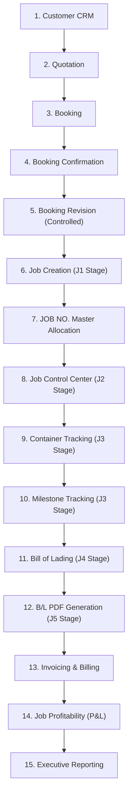

# SYSTEM MASTER WORKFLOW

> **AUDIT STATUS**: COMPLETED  
> **RULE**: NO SOURCE CODE OR DATABASE SCHEMAS WERE MODIFIED DURING THIS WORKFLOW AUDIT.

---

## 1. Executive Summary & Non-Technical Business Overview

### How Smart Freight NTT Works (For Non-Technical Users)
Imagine running a freight forwarding business like managing a high-precision relay race:

1. **Customer & Inquiry**: A client comes in wanting to ship goods overseas (e.g. 20ft container of electronics from Bangkok to Hamburg).
2. **Quotation**: Sales calculates freight rates, duty, and local charges, then issues an official **Quotation**.
3. **Booking**: Once accepted, Operations books vessel space with a shipping line (Carrier) and generates a **Booking Confirmation**. If details change (e.g., vessel name or CY date), a **Booking Revision** is created cleanly with a clear audit record.
4. **Job Creation & JOB NO.**: Once space is confirmed, the Booking converts into an active operational **Job**. The system assigns a unique **JOB NO.** (e.g., `SE26080001`). This **JOB NO.** becomes the central master tag for everything that follows.
5. **Shipment Execution (Containers, Milestones & B/L)**: Operations tracks container numbers, seal numbers, gate-in dates, vessel departure (ETD), arrival (ETA), and issues the official **Bill of Lading (B/L)**.
6. **Finance, Billing & Profit**: Accounts Receivable issues Tax Invoices to the customer, Accounts Payable records vendor costs, and the system automatically calculates the net **Job Profitability (P&L)**.

---

## 2. Technical Operational Workflow Topology



---

## 3. 15-Stage Operational Breakdown Matrix

### Stage 1: Customer CRM Management
1. **What it is**: Customer directory and credit terms manager.
2. **Why it exists**: Maintains clean company master data and prevents duplicate client profiles.
3. **Data Enters**: Company Name, Tax ID, Address, Contact Person, Tel, Email, Credit Terms Days.
4. **Data Generated**: Customer ID (`id`).
5. **DB Table**: `customers`.
6. **Manager**: [`managers/customer_manager.py`](file:///c:/Users/User/Desktop/Got/Smart%20Freight%20NTT,/managers/customer_manager.py).
7. **View**: [`views/crm_view.py`](file:///c:/Users/User/Desktop/Got/Smart%20Freight%20NTT,/views/crm_view.py).
8. **PDF**: None.
9. **Statuses**: `is_active` (`True` / `False`).
10. **What Can Be Edited**: Contact person, email, tel, address, tax ID, credit terms.
11. **What Becomes Locked**: Customer ID (`id`).
12. **What Can Be Revised**: Contact info and credit terms at any time.
13. **What Can Be Deleted**: Deplicable customer records if no active linked quotations/jobs exist.
14. **References Previous**: Initial entry point.
15. **Passes To**: Stage 2 (Quotation) & Stage 3 (Booking).

---

### Stage 2: Quotation
1. **What it is**: Commercial rate proposal for freight services.
2. **Why it exists**: Formalizes selling rates and terms with the shipper before locking space.
3. **Data Enters**: Customer ID, POL, POD, Commodity, Service Type, Rate line items, Incoterm.
4. **Data Generated**: `QUOTATION NO.` (e.g. `QT26080001`).
5. **DB Tables**: `quotations`, `quotation_items`.
6. **Manager**: [`managers/quotation_manager.py`](file:///c:/Users/User/Desktop/Got/Smart%20Freight%20NTT,/managers/quotation_manager.py).
7. **View**: [`views/quotation_view.py`](file:///c:/Users/User/Desktop/Got/Smart%20Freight%20NTT,/views/quotation_view.py).
8. **PDF**: [`pdf/quotation_pdf.py`](file:///c:/Users/User/Desktop/Got/Smart%20Freight%20NTT,/pdf/quotation_pdf.py).
9. **Statuses**: `ACTIVE`, `EXPIRED`, `CONVERTED`.
10. **What Can Be Edited**: POL, POD, rate lines, validity date (while status is `ACTIVE`).
11. **What Becomes Locked**: `QUOTATION NO.` once saved.
12. **What Can Be Revised**: Rate items and validity date until status changes to `CONVERTED`.
13. **What Can Be Deleted**: Draft quotations without linked bookings.
14. **References Previous**: Customer ID from Stage 1.
15. **Passes To**: Stage 3 (Booking).

---

### Stage 3: Booking
1. **What it is**: Pre-operational commercial booking manifest.
2. **Why it exists**: Secures vessel/flight space from carriers.
3. **Data Enters**: Quotation No., Customer, Carrier, Vessel/Flight, POL, POD, ETD, ETA, Cargo type.
4. **Data Generated**: `BOOKING NO.` (e.g. `BK26080001`).
5. **DB Table**: `bookings`.
6. **Manager**: [`managers/booking_manager.py`](file:///c:/Users/User/Desktop/Got/Smart%20Freight%20NTT,/managers/booking_manager.py).
7. **View**: [`views/booking_view.py`](file:///c:/Users/User/Desktop/Got/Smart%20Freight%20NTT,/views/booking_view.py).
8. **PDF**: [`pdf/booking_pdf.py`](file:///c:/Users/User/Desktop/Got/Smart%20Freight%20NTT,/pdf/booking_pdf.py).
9. **Statuses**: `DRAFT`, `SUBMITTED`, `CONFIRMED`, `CONVERTED TO JOB`, `CANCELLED`.
10. **What Can Be Edited**: Vessel, voyage, dates, container summary (while status is `DRAFT` or `SUBMITTED`).
11. **What Becomes Locked**: Direct editing is locked once status reaches `CONFIRMED`.
12. **What Can Be Revised**: Requires creating a Revision Snapshot (Stage 5).
13. **What Can Be Deleted**: Draft bookings only.
14. **References Previous**: `quotation_no` / `quotation_id` from Stage 2.
15. **Passes To**: Stage 4 & 5.

---

### Stage 4: Booking Confirmation
1. **What it is**: Carrier-confirmed booking clearance.
2. **Why it exists**: Signals that space and equipment are allocated on the vessel.
3. **Data Enters**: Carrier Booking Confirmation No., Cut-off closing times, CY/CFS dates.
4. **Data Generated**: Status transition to `CONFIRMED`.
5. **DB Table**: `bookings`.
6. **Manager**: [`managers/booking_manager.py`](file:///c:/Users/User/Desktop/Got/Smart%20Freight%20NTT,/managers/booking_manager.py).
7. **View**: [`views/booking_view.py`](file:///c:/Users/User/Desktop/Got/Smart%20Freight%20NTT,/views/booking_view.py).
8. **PDF**: [`pdf/booking_pdf.py`](file:///c:/Users/User/Desktop/Got/Smart%20Freight%20NTT,/pdf/booking_pdf.py).
9. **Statuses**: `CONFIRMED`.
10. **What Can Be Edited**: Locked from direct form edits.
11. **What Becomes Locked**: Booking core fields locked.
12. **What Can Be Revised**: Revisions permitted via Stage 5 modal.
13. **What Can Be Deleted**: Cannot be deleted; must be marked `CANCELLED`.
14. **References Previous**: `BOOKING NO.` from Stage 3.
15. **Passes To**: Stage 6 (Job Creation).

---

### Stage 5: Booking Revision Control
1. **What it is**: Audit log of changes made to confirmed bookings.
2. **Why it exists**: Maintains historical traceability when vessel schedules or cargo weights change post-confirmation.
3. **Data Enters**: Revision Reason, Modified fields.
4. **Data Generated**: `REVISION NO.` (incremented `revision_no`), JSON snapshot in `booking_revisions`.
5. **DB Table**: `booking_revisions`.
6. **Manager**: [`managers/booking_manager.py`](file:///c:/Users/User/Desktop/Got/Smart%20Freight%20NTT,/managers/booking_manager.py).
7. **View**: [`views/booking_view.py`](file:///c:/Users/User/Desktop/Got/Smart%20Freight%20NTT,/views/booking_view.py).
8. **PDF**: [`pdf/booking_pdf.py`](file:///c:/Users/User/Desktop/Got/Smart%20Freight%20NTT,/pdf/booking_pdf.py) (Historical revision PDF).
9. **Statuses**: Tracks revision history count.
10. **What Can Be Edited**: Revision reason string during submission.
11. **What Becomes Locked**: Previous revision snapshots are immutable.
12. **What Can Be Revised**: New revisions increment `revision_no`.
13. **What Can Be Deleted**: Revision history cannot be deleted.
14. **References Previous**: `BOOKING NO.` from Stage 4.
15. **Passes To**: Stage 6.

---

### Stage 6 & 7: Job Creation & JOB NO. Master Allocation (J1 / J2)
1. **What it is**: Transition from commercial booking to active physical job.
2. **Why it exists**: Establishes the operational master record for logistics execution.
3. **Data Enters**: Confirmed Booking ID.
4. **Data Generated**: **`JOB NO.`** (e.g., `SE26080001`, `SI26080001`, `AE26080001`).
5. **DB Tables**: `shipments`, `job_counters`, `bookings`.
6. **Manager**: [`managers/booking_manager.py`](file:///c:/Users/User/Desktop/Got/Smart%20Freight%20NTT,/managers/booking_manager.py) & [`managers/shipment_manager.py`](file:///c:/Users/User/Desktop/Got/Smart%20Freight%20NTT,/managers/shipment_manager.py).
7. **View**: [`views/shipment_view.py`](file:///c:/Users/User/Desktop/Got/Smart%20Freight%20NTT,/views/shipment_view.py).
8. **PDF**: Indirect.
9. **Statuses**: Booking status becomes `CONVERTED TO JOB`; Job status becomes `Proceed`.
10. **What Can Be Edited**: Job routing, vessel, voyage, shipper, consignee.
11. **What Becomes Locked**: `JOB NO.` and linked `booking_no` association.
12. **What Can Be Revised**: Routing dates and vessel info in Job Control Center.
13. **What Can Be Deleted**: Converted bookings are permanently locked from deletion.
14. **References Previous**: `BOOKING NO.` from Stage 4.
15. **Passes To**: Stage 8, 9, 10.

---

### Stage 8: Job Control Center (J2)
1. **What it is**: Master operational control desk for an active shipment.
2. **Why it exists**: Provides single-pane-of-glass operational management.
3. **Data Enters**: Actual Departure (ATD), Actual Arrival (ATA), Customs Declaration No., Customs Status.
4. **Data Generated**: Updated shipment record.
5. **DB Table**: `shipments`.
6. **Manager**: [`managers/shipment_manager.py`](file:///c:/Users/User/Desktop/Got/Smart%20Freight%20NTT,/managers/shipment_manager.py).
7. **View**: [`views/shipment_view.py`](file:///c:/Users/User/Desktop/Got/Smart%20Freight%20NTT,/views/shipment_view.py).
8. **PDF**: None.
9. **Statuses**: `Proceed`, `In_Transit`, `Arrived`, `Completed`, `Cancelled`.
10. **What Can Be Edited**: ATD, ATA, customs info, special cargo notes.
11. **What Becomes Locked**: `JOB NO.`.
12. **What Can Be Revised**: Shipment status workflow steps.
13. **What Can Be Deleted**: Active jobs cannot be deleted if containers or B/Ls exist.
14. **References Previous**: `JOB NO.` from Stage 7.
15. **Passes To**: Stage 9, 10, 11.

---

### Stage 9: Container Tracking (J3)
1. **What it is**: Container manifest management tab.
2. **Why it exists**: Tracks physical shipping containers, seal numbers, VGM, and equipment types.
3. **Data Enters**: Container No., Size (`20GP`, `40HC`), Type (`GP`, `RF`), Seal No., VGM (kg), Tare/Gross weight.
4. **Data Generated**: Container ID records.
5. **DB Table**: `containers`.
6. **Manager**: [`managers/container_manager.py`](file:///c:/Users/User/Desktop/Got/Smart%20Freight%20NTT,/managers/container_manager.py).
7. **View**: [`views/shipment_view.py`](file:///c:/Users/User/Desktop/Got/Smart%20Freight%20NTT,/views/shipment_view.py).
8. **PDF**: Feeds container details into B/L PDF.
9. **Statuses**: `Loaded`, `Gated-In`, `Discharged`, `Delivered`.
10. **What Can Be Edited**: Seal No, VGM, gross weight.
11. **What Becomes Locked**: Container No once linked to an issued B/L.
12. **What Can Be Revised**: VGM and weight figures.
13. **What Can Be Deleted**: Unlinked container records.
14. **References Previous**: `JOB NO.` & `shipment_id` from Stage 7.
15. **Passes To**: Stage 11 (B/L Container Mapping).

---

### Stage 10: Milestone Tracking (J3)
1. **What it is**: Event timeline logger.
2. **Why it exists**: Tracks progress milestones (Gate In, Departed POL, Arrived POD, Delivered).
3. **Data Enters**: Milestone Code, Event Date/Time, Location, Remarks.
4. **Data Generated**: Milestone audit entry.
5. **DB Table**: `shipment_milestones`.
6. **Manager**: [`managers/milestone_manager.py`](file:///c:/Users/User/Desktop/Got/Smart%20Freight%20NTT,/managers/milestone_manager.py).
7. **View**: [`views/shipment_view.py`](file:///c:/Users/User/Desktop/Got/Smart%20Freight%20NTT,/views/shipment_view.py) & [`views/tracking_view.py`](file:///c:/Users/User/Desktop/Got/Smart%20Freight%20NTT,/views/tracking_view.py).
8. **PDF**: None.
9. **Statuses**: Time-sequenced milestone events.
10. **What Can Be Edited**: Location, remarks, event date.
11. **What Becomes Locked**: Created timestamp.
12. **What Can Be Revised**: Milestone details.
13. **What Can Be Deleted**: Individual milestone entries before job completion.
14. **References Previous**: `JOB NO.` from Stage 7.
15. **Passes To**: Stage 15 (Public Tracking).

---

### Stage 11 & 12: Bill of Lading & B/L PDF (J4 / J5)
1. **What it is**: Official maritime transport document generation.
2. **Why it exists**: Acts as document of title, receipt of goods, and contract of carriage.
3. **Data Enters**: B/L Type (`Original`, `Express_Release`, `Seaway_Bill`), Shipper, Consignee, Notify Party, Marks & Numbers, Container mapping.
4. **Data Generated**: `B/L NO.` (e.g. `HBL26080001`).
5. **DB Tables**: `bills_of_lading`, `bl_containers`.
6. **Manager**: [`managers/bl_manager.py`](file:///c:/Users/User/Desktop/Got/Smart%20Freight%20NTT,/managers/bl_manager.py).
7. **View**: [`views/bl_view.py`](file:///c:/Users/User/Desktop/Got/Smart%20Freight%20NTT,/views/bl_view.py).
8. **PDF**: [`pdf/bl_pdf.py`](file:///c:/Users/User/Desktop/Got/Smart%20Freight%20NTT,/pdf/bl_pdf.py).
9. **Statuses**: `Draft`, `Issued`, `Cancelled`.
10. **What Can Be Edited**: Shipper, consignee, description of goods (while status is `Draft`).
11. **What Becomes Locked**: Once status transitions to `Issued`, core B/L fields lock.
12. **What Can Be Revised**: Re-issuance requires administrative status unlock.
13. **What Can Be Deleted**: Draft B/Ls only.
14. **References Previous**: `JOB NO.` & `container_id` from Stage 7 & 9.
15. **Passes To**: Stage 13 (Billing & Invoicing).

---

### Stage 13: Finance & Invoicing (AR / AP)
1. **What it is**: Billing and Accounts Receivable module.
2. **Why it exists**: Issues legally compliant Thai Tax Invoices / Billing Notes to customers and tracks payments.
3. **Data Enters**: Line item descriptions, Unit prices, Tax Type (`VAT 7%`, `Zero-Rated`), WHT (`1%`, `3%`).
4. **Data Generated**: `INVOICE NO.` (e.g., `IV26080001`).
5. **DB Tables**: `invoices`, `invoice_items`.
6. **Manager**: [`managers/invoice_manager.py`](file:///c:/Users/User/Desktop/Got/Smart%20Freight%20NTT,/managers/invoice_manager.py).
7. **View**: [`views/billing_view.py`](file:///c:/Users/User/Desktop/Got/Smart%20Freight%20NTT,/views/billing_view.py).
8. **PDF**: [`pdf/invoice_pdf.py`](file:///c:/Users/User/Desktop/Got/Smart%20Freight%20NTT,/pdf/invoice_pdf.py).
9. **Statuses**: `Unpaid`, `Partial`, `Paid`, `Cancelled`.
10. **What Can Be Edited**: Line items, quantities, prices (while status is `Unpaid`).
11. **What Becomes Locked**: Invoice Number, Issue Date, Tax ID once paid.
12. **What Can Be Revised**: Outstanding amount upon partial payment.
13. **What Can Be Deleted**: Unpaid invoices (with audit log).
14. **References Previous**: `JOB NO.` & `customer_id` from Stage 7 & 1.
15. **Passes To**: Stage 14 (Job Profitability).

---

### Stage 14: Job Profitability (P&L Ledger)
1. **What it is**: Job financial summary sheet comparing Total Selling (AR) vs Total Costs (AP).
2. **Why it exists**: Ensures every shipment achieves profitable margins.
3. **Data Enters**: Vendor cost line items, Currency conversion rates.
4. **Data Generated**: `PROFIT SHEET NO.` (e.g. `PS26080001`), Net Profit THB, Profit Margin %.
5. **DB Tables**: `profit_sheets`, `job_costs`.
6. **Manager**: [`managers/profit_manager.py`](file:///c:/Users/User/Desktop/Got/Smart%20Freight%20NTT,/managers/profit_manager.py).
7. **View**: [`views/profit_view.py`](file:///c:/Users/User/Desktop/Got/Smart%20Freight%20NTT,/views/profit_view.py).
8. **PDF**: [`pdf/profit_pdf.py`](file:///c:/Users/User/Desktop/Got/Smart%20Freight%20NTT,/pdf/profit_pdf.py).
9. **Statuses**: `Draft`, `Reviewed`, `Approved`.
10. **What Can Be Edited**: Cost categories, vendor amounts.
11. **What Becomes Locked**: Profit Sheet once status is `Approved`.
12. **What Can Be Revised**: Cost lines before approval.
13. **What Can Be Deleted**: Draft cost entries.
14. **References Previous**: `JOB NO.` from Stage 7.
15. **Passes To**: Stage 15 (Executive Reporting).

---

### Stage 15: Executive Reporting & Control Tower
1. **What it is**: High-level operational analytics and CSV export dashboard.
2. **Why it exists**: Provides management visibility into revenue, volume, and operational performance.
3. **Data Enters**: Date range selection, job type filters.
4. **Data Generated**: Aggregated dataframes and downloadable CSV files.
5. **DB Tables**: Reads all 12 database tables.
6. **Manager**: [`managers/dashboard_manager.py`](file:///c:/Users/User/Desktop/Got/Smart%20Freight%20NTT,/managers/dashboard_manager.py) & [`managers/kpi_manager.py`](file:///c:/Users/User/Desktop/Got/Smart%20Freight%20NTT,/managers/kpi_manager.py).
7. **View**: [`views/dashboard_view.py`](file:///c:/Users/User/Desktop/Got/Smart%20Freight%20NTT,/views/dashboard_view.py) & [`views/reports_view.py`](file:///c:/Users/User/Desktop/Got/Smart%20Freight%20NTT,/views/reports_view.py).
8. **PDF**: None.
9. **Statuses**: Read-only reporting.
10. **What Can Be Edited**: Read-only view.
11. **What Becomes Locked**: Historical records.
12. **What Can Be Revised**: Filter parameters.
13. **What Can Be Deleted**: None.
14. **References Previous**: Aggregates all previous stages.
15. **Passes To**: Executive decision making.

---

## 4. Master Identifier Hierarchy & Control Matrix

| Identifier | Format Example | Primary Control Scope | Originating Stage | Lock Rule |
| :--- | :--- | :--- | :--- | :--- |
| **`QUOTATION NO`** | `QT26080001` | Pre-Sales Commercial Quote | Stage 2 (Quotation) | Locked upon conversion to Booking |
| **`BOOKING NO`** | `BK26080001` | Pre-Operational Space Reservation | Stage 3 (Booking) | Locked upon status `CONFIRMED` |
| **`REVISION NO`** | `1`, `2`, `3` | Booking Modification Versioning | Stage 5 (Booking Revision) | Immutable once snapshot created |
| **`JOB NO`** | **`SE26080001`** | **MASTER OPERATIONAL REFERENCE** | **Stage 6 (Job Creation)** | **Permanent Master Operational Key** |
| **`B/L NO`** | `HBL26080001` | Maritime Bill of Lading Document | Stage 11 (Bill of Lading) | Locked upon status `Issued` |
| **`INVOICE NO`** | `IV26080001` | Tax Invoice & Accounting Reference | Stage 13 (Billing) | Locked upon status `Paid` |

---

## 5. "WHAT SHOULD THE USER SEE?" (Ideal Navigation Flow)

```
1. Dashboard Tower ──(Click 'Bookings')──> 2. Booking Ledger
                                                 │
                                     (Click 'Convert to Job')
                                                 │
                                                 ▼
4. Billing & P&L <──(Click 'Bill of Lading')── 3. Job Control Desk
```

1. **Step 1: Operational Dashboard Tower**
   - User logs in and lands on **Control Tower Dashboard** ([`views/dashboard_view.py`](file:///c:/Users/User/Desktop/Got/Smart%20Freight%20NTT,/views/dashboard_view.py)).
   - Sees active KPI cards (Total Quotations, Active Bookings, Active Jobs, Monthly Revenue) and Exception Alerts (Confirmed Bookings pending Job conversion).
2. **Step 2: Booking Control Center**
   - User clicks **"📑 Booking"** in navigation.
   - Lands on **Booking Ledger**. Filters by status `CONFIRMED`.
   - Selects a confirmed booking and clicks **"🚀 Convert Booking to Job"**.
3. **Step 3: Job Control Center**
   - System automatically generates a unique **`JOB NO.`** (e.g. `SE26080001`) and navigates to **"📦 Job Control Center"** ([`views/shipment_view.py`](file:///c:/Users/User/Desktop/Got/Smart%20Freight%20NTT,/views/shipment_view.py)).
   - User enters container numbers in the **Containers Tab**, updates milestones in the **Milestones Tab**, and updates vessel ATD/ATA.
4. **Step 4: Bill of Lading Workspace**
   - User clicks **"📜 Bill of Lading"** in navigation or clicks **"Create B/L"** from Job Detail.
   - Attaches physical containers to the B/L, previews document, and clicks **"⚡ Download B/L PDF"**.
5. **Step 5: Invoicing & Profitability**
   - User navigates to **"💳 Invoicing"** ([`views/billing_view.py`](file:///c:/Users/User/Desktop/Got/Smart%20Freight%20NTT,/views/billing_view.py)) to generate a Tax Invoice for the customer.
   - Navigates to **"📊 Job Profitability"** ([`views/profit_view.py`](file:///c:/Users/User/Desktop/Got/Smart%20Freight%20NTT,/views/profit_view.py)) to review vendor costs and export the final Profit Sheet PDF.
