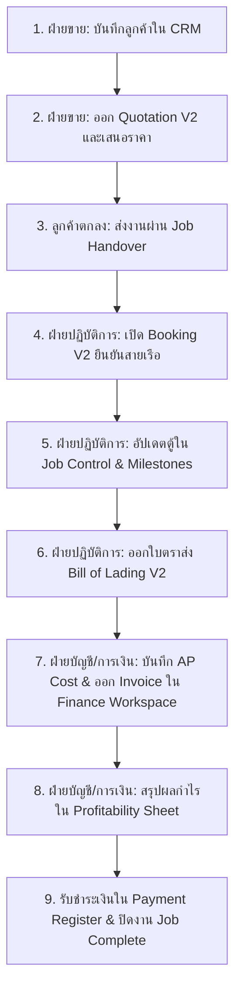

# 🚢 SMART FREIGHT NTT — COMPREHENSIVE USER MANUAL
# คู่มือการใช้งานระบบจัดการขนส่งสินค้าและโลจิสติกส์ครบวงจร

**System Version:** Phase 30 Enterprise Consolidated Edition  
**Company:** NATTAYARAAT CO., LTD.  
**Contact:** Management@nattayaraat.com · Tel: 063-428-9691  

---

## 📑 TABLE OF CONTENTS / สารบัญ

- [🇹🇭 ส่วนที่ 1: คู่มือการใช้งานภาษาไทย (Thai Manual)](#-ส่วนที่-1-คู่มือการใช้งานภาษาไทย)
  - [1. ภาพรวมระบบ (System Overview)](#1-ภาพรวมระบบ-system-overview)
  - [2. การเข้าสู่ระบบและสิทธิ์การใช้งาน (Authentication & RBAC)](#2-การเข้าสู่ระบบและสิทธิ์การใช้งาน-authentication--rbac)
  - [3. กลุ่มเมนู Master Data (ข้อมูลหลัก)](#3-กลุ่มเมนู-master-data-ข้อมูลหลัก)
  - [4. กลุ่มเมนู Sales & CRM (งานขายและลูกค้าสัมพันธ์)](#4-กลุ่มเมนู-sales--crm-งานขายและลูกค้าสัมพันธ์)
  - [5. กลุ่มเมนู Operations (การปฏิบัติการขนส่ง)](#5-กลุ่มเมนู-operations-การปฏิบัติการขนส่ง)
  - [6. Document Center (ศูนย์รวมเอกสารและระบบอนุมัติ)](#6-document-center-ศูนย์รวมเอกสารและระบบอนุมัติ)
  - [7. Finance & Accounting (การเงิน บัญชี และกำไร-ขาดทุน)](#7-finance--accounting-การเงิน-บัญชี-และกำไร-ขาดทุน)
  - [8. System Admin & Health (การจัดการระบบและตรวจสุขภาพ)](#8-system-admin--health-การจัดการระบบและตรวจสุขภาพ)
  - [9. แผนผังการทำงานจริง End-to-End (Complete Workflow)](#9-แผนผังการทำงานจริง-end-to-end-complete-workflow)
  - [10. คำถามที่พบบ่อยและการแก้ปัญหา (FAQ & Troubleshooting)](#10-คำถามที่พบบ่อยและการแก้ปัญหา-faq--troubleshooting)
- [🇬🇧 Part 2: English User Manual](#-part-2-english-user-manual)
  - [1. System Overview & Architecture](#1-system-overview--architecture)
  - [2. Authentication & Role-Based Access Control (RBAC)](#2-authentication--role-based-access-control-rbac)
  - [3. Master Data Management](#3-master-data-management)
  - [4. Sales & CRM Operations](#4-sales--crm-operations)
  - [5. Freight Operations & Logistics](#5-freight-operations--logistics)
  - [6. Document Control & Multi-Stage Approval](#6-document-control--multi-stage-approval)
  - [7. Finance, Accounting & Job Profitability](#7-finance-accounting--job-profitability)
  - [8. System Administration & Diagnostics](#8-system-administration--diagnostics)
  - [9. End-to-End Operational Lifecycle](#9-end-to-end-operational-lifecycle)
  - [10. FAQ & Troubleshooting Guide](#10-faq--troubleshooting-guide)

---

# 🇹🇭 ส่วนที่ 1: คู่มือการใช้งานภาษาไทย

---

## 1. ภาพรวมระบบ (System Overview)

**Smart Freight NTT** คือระบบ ERP บริหารจัดการงานขนส่งสินค้าระหว่างประเทศและโลจิสติกส์ (Freight Forwarding Management System) ครอบคลุมวงจรการทำงานตั้งแต่การเสนอราคา ออกใบจองเรือ ติดตามตู้สินค้า ออกใบตราส่งทางทะเล (B/L) บันทึกรายรับ-รายจ่าย (AR/AP) ไปจนถึงการจัดทำใบกำกับภาษี ใบเสร็จรับเงิน และสรุปกำไร-ขาดทุนราย Job แบบ Real-time

### คุณสมบัติเด่นของระบบ:
- **Single Source of Truth (SSOT):** ข้อมูลเชื่อมต่อกันอย่างสมบูรณ์ เช่น เมื่อ Quotation ได้รับการอนุมัติ สามารถแปลงเป็น Job ได้ในคลิกเดียวโดยไม่ต้องกรอกข้อมูลซ้ำ
- **3-Stage Approval Engine:** ระบบควบคุมความถูกต้องของเอกสาร (Draft ➔ Pending Approval ➔ Approved ➔ Locked)
- **Multi-Currency & FX Engine:** รองรับสกุลเงินสากล (THB, USD, EUR, CNY, SGD, JPY) พร้อมคำนวณอัตราแลกเปลี่ยนอัตโนมัติ
- **Container & Milestone Tracking:** ติดตามสถานะตู้สินค้าทุกใบ วันคืนตู้ เคลียร์ตู้ และตารางเดินเรือ

---

## 2. การเข้าสู่ระบบและสิทธิ์การใช้งาน (Authentication & RBAC)

### 2.1 การเข้าสู่ระบบ (Login)
1. เปิดเว็บบราวเซอร์ (แนะนำ Google Chrome, Microsoft Edge หรือ Safari)
2. เข้าสู่ระบบด้วย **Username** และ **Password** ที่ได้รับมอบหมาย
3. กดปุ่ม **Sign In**

```
+-------------------------------------------------------------+
|                     SMART FREIGHT NTT                       |
|               Enterprise Logistics Suite                    |
|                                                             |
|   Username: [ admin               ]                         |
|   Password: [ ******************  ]                         |
|                                                             |
|                  [ 🔐 SIGN IN ]                             |
+-------------------------------------------------------------+
```

### 2.2 โครงสร้างสิทธิ์ผู้ใช้งาน (Role-Based Access Control)

| บทบาท (Role) | สิทธิ์และหน้าที่รับผิดชอบ | เมนูที่เข้าถึงได้ |
| :--- | :--- | :--- |
| **👑 Admin (ผู้ดูแลระบบ)** | สิทธิ์สูงสุดในระบบ จัดการผู้ใช้ ตรวจสอบ Audit Log และตั้งค่าระบบทั้งหมด | เข้าถึงได้ทุกเมนู |
| **👔 Management (ผู้บริหาร)** | ดูภาพรวม สรุปผลการดำเนินงาน อนุมัติเอกสาร และรายงานผลกำไร | Dashboard, Reports, Quotation, Booking, Job, Profit, Health |
| **💼 Sales (ฝ่ายขาย)** | จัดการฐานข้อมูลลูกค้า (CRM), สร้างใบเสนอราคา (Quotation), ส่งต่องานให้ฝ่ายปฏิบัติการ (Handover) | CRM, Quotations, Job Handover, Master Data, Rates |
| **🚢 Operations / CS (ฝ่ายปฏิบัติการ)** | รับงานจากฝ่ายขาย, จองเรือ (Booking), จัดการใบคุมงาน (Jobs), ติดตามตู้ (Milestones), ออก B/L | Bookings, Jobs, Bills of Lading, Documents, Master Data |
| **💰 Accounting / Billing (ฝ่ายการเงิน)** | ออกใบวางบิล, ใบเสร็จ/ใบกำกับภาษี, บันทึกการรับชำระเงิน, ควบคุมค่าใช้จ่าย (AP) และ Profit Sheet | Finance (Billing), Payables (AP), Profitability, Reports |

---

## 3. กลุ่มเมนู Master Data (ข้อมูลหลัก)

ข้อมูลหลักคือหัวใจของระบบที่ช่วยให้การออกเอกสารต่างๆ ถูกต้องและรวดเร็ว

### 3.1 ท่าเรือและจุดขนถ่าย (Ports & Places)
- **เมนู:** `DATA ➔ Master Data ➔ Ports`
- **การใช้งาน:**
  1. เลือกโหมด **"Ports"**
  2. กดแท็บ **"New"** เพื่อเพิ่มท่าเรือใหม่
  3. ระบุ **Port Code** (5 ตัวอักษร เช่น `THBKK`, `SGSIN`), **UN/LOCODE**, **Port Name**, **City**, **Country Code** และ **Timezone**
  4. กด **Save Port**

### 3.2 คู่ค้าและพันธมิตรทางธุรกิจ (Business Parties)
- **เมนู:** `DATA ➔ Master Data ➔ Business Parties`
- **ประเภทคู่ค้า:** `CUSTOMER`, `CARRIER`, `VENDOR`, `AGENT`, `CO_LOADER`, `SHIPPER`, `CONSIGNEE`
- **การใช้งาน:**
  1. ระบุรหัสคู่ค้า (Party Code 5 ตัวอักษร), ชื่อจดทะเบียน (Legal Name), เลขประจำตัวผู้เสียภาษี (Tax ID), สาขา และที่อยู่
  2. กำหนด **Credit Limit (วงเงินเครดิต)** และ **Credit Days (ระยะเวลาเครดิตเทอม)**
  3. บันทึกข้อมูลบัญชีธนาคารสำหรับการชำระเงิน

### 3.3 รายการค่าบริการมาตรฐาน (Charge Master)
- **เมนู:** `DATA ➔ Master Data ➔ Charges`
- **การใช้งาน:** กำหนดรหัสค่าบริการ เช่น `O/F` (Ocean Freight), `THC` (Terminal Handling Charge), `CUSTOMS` (Customs Clearance) พร้อมกำหนด Basis (ต่อตู้/ต่อ shipment) และประเภทภาษี VAT/WHT เริ่มต้น

### 3.4 ตารางราคาและค่าระวาง (Rate Master)
- **เมนู:** `DATA ➔ Rate Master`
- **การใช้งาน:**
  1. กดปุ่ม **"＋ New Rate Card"**
  2. ระบุสายเรือ (Carrier), ท่าเรือต้นทาง (POL), ท่าเรือปลายทาง (POD), ขนาดตู้ (Equipment Type)
  3. กำหนดวันที่มีผล (Valid From - Valid To)
  4. ใส่ตารางค่าระวางและค่าใช้จ่าย Local Charges แล้วกด **Save Rate Card**

---

## 4. กลุ่มเมนู Sales & CRM (งานขายและลูกค้าสัมพันธ์)

```
[ CRM: บันทึกประวัติลูกค้า ] ➔ [ QUOTATION: ออกใบเสนอราคา ] ➔ [ HANDOVER: ส่งงานเข้าปฏิบัติการ ]
```

### 4.1 ข้อมูลลูกค้าและวงเงินเครดิต (CRM)
- **เมนู:** `SALES ➔ Customers`
- **การใช้งาน:**
  1. ค้นหาและดูสถานะวงเงินคงเหลือของลูกค้า (Credit Limit vs Outstanding Balance)
  2. บันทึกผู้ติดต่อ (Contact Persons), เบอร์โทร, อีเมล, เงื่อนไขการชำระเงิน และวงเงินเครดิต

### 4.2 การสร้างใบเสนอราคา (Quotations V2)
- **เมนู:** `SALES ➔ Quotations`
- **ขั้นตอนการสร้าง:**
  1. กดปุ่ม **"＋ New Quotation"**
  2. เลือกลูกค้า (Customer) และระบุโหมดการขนส่ง (SEA-FCL, SEA-LCL, AIR, TRUCK)
  3. เลือกท่าเรือต้นทาง-ปลายทาง (POL/POD) และกำหนดวันหมดอายุของใบเสนอราคา
  4. เพิ่มรายการค่าบริการ (Charge Items): Ocean Freight, THC, Bill of Lading Fee, Customs Clearance ฯลฯ
  5. ระบบคำนวณยอดรวมภาษี VAT 7% และหัก ณ ที่จ่าย (WHT) ให้อัตโนมัติ
  6. กด **Create Quotation (สร้างแบบร่าง Draft)**
  7. เมื่อตรวจทานเรียบร้อย กด **Submit for Approval** เพื่อส่งให้หัวหน้างาน/ผู้จัดการอนุมัติ
  8. กดปุ่ม **"PDF"** เพื่อสร้างและดาวน์โหลดเอกสารใบเสนอราคาพร้อมส่งให้ลูกค้า

### 4.3 การส่งต่องาน (Job Handover)
- **เมนู:** `SALES ➔ Job Handover`
- **ขั้นตอนการทำงาน:**
  1. เมื่อลูกค้าตกลงรับใบเสนอราคา (Quotation สถานะ Won/Approved)
  2. ฝ่ายขายเลือกใบเสนอราคาที่ต้องการส่งงาน
  3. ระบุข้อความสั่งงานพิเศษ (Operational Instructions) เช่น วันที่ตู้ต้องถึงโรงงาน หรือเอกสารพิเศษที่ต้องขอ
  4. กด **"Create Operations Job"** ➔ ระบบจะสร้าง Job ใหม่ในระบบ Operations ทันทีโดยนำเข้าข้อมูลต้นทาง-ปลายทาง อัตราค่าบริการ และคู่ค้าอัตโนมัติ

---

## 5. กลุ่มเมนู Operations (การปฏิบัติการขนส่ง)

### 5.1 การเปิดใบจองเรือ (Bookings V2)
- **เมนู:** `OPERATIONS ➔ Bookings`
- **ขั้นตอนการทำงาน:**
  1. กด **"＋ New Booking"**
  2. เลือกลูกค้าและสายเรือ (Carrier/Liner)
  3. ระบุเลขจองของสายเรือ (Carrier Booking No.), ชื่อเรือ/เที่ยวเรือ (Vessel/Voyage)
  4. กำหนดวันตัดคืนตู้ (Closing Date), วันรับตู้เปล่า (Pick-up Empty Date), วันที่เรือออก (ETD) และวันเรือถึง (ETA)
  5. บันทึกขนาดและจำนวนตู้ (เช่น 20'GP x 2, 40'HC x 1)
  6. กด **Create Booking** และสามารถกดพิมพ์ **Booking Confirmation PDF** ส่งให้ Shipper/โรงงานได้ทันที

### 5.2 ใบคุมงานขนส่ง 360 องศา (Job Control Tower)
- **เมนู:** `OPERATIONS ➔ Jobs`
- **ศูนย์กลางบริหารงานแบบครบวงจร 7 แท็บ:**
  1. **Overview:** ข้อมูลสรุปของ Job, เส้นทาง, ลูกค้า, วันที่สำคัญ
  2. **Operations:** บันทึกสายการเดินเรือ, ตัวแทนปลายทาง (Overseas Agent), ข้อมูลศุลกากร
  3. **Cargo & Containers:** บันทึกเบอร์เลขตู้ (Container No.), เบอร์ซีลล็อค (Seal No.), น้ำหนักรวม (Gross Weight), ปริมาตร (CBM)
  4. **Milestones:** บันทึก Time Log ลำดับเหตุการณ์ขนส่ง (Booking Placed ➔ Container Released ➔ Gate In ➔ Vessel Departed ➔ Arrived at POD ➔ Delivered ➔ Empty Returned)
  5. **Documents:** เข้าถึงเอกสารที่เกี่ยวข้องของ Job ทั้งหมด
  6. **Financial:** บันทึกและตรวจสอบค่าใช้จ่ายจริงที่เกิดขึ้น (AR/AP Real Cost)
  7. **History / Audit Trail:** บันทึกประวัติการแก้ไขข้อมูลของ Job ทุกครั้ง

### 5.3 ใบตราส่งสินค้าทางทะเล (Bills of Lading - B/L V2)
- **เมนู:** `OPERATIONS ➔ Bills of Lading`
- **ขั้นตอนการทำงาน:**
  1. กด **"＋ New B/L"** หรือเลือก Job ที่ต้องการออก B/L
  2. เลือกว่าต้องการออก **Master B/L (MBL)** หรือ **House B/L (HBL)**
  3. ระบุ Shipper, Consignee, Notify Party, Port of Loading, Port of Discharge
  4. กรอกรายละเอียด Marks and Numbers, Description of Goods, Weight & Measurement
  5. ระบุเงื่อนไขค่าระวาง (Freight Prepaid หรือ Freight Collect)
  6. กด **Save B/L** ➔ ตรวจทาน Draft ➔ กด **Submit for Approval**
  7. กดปุ่ม **"PDF"** เพื่อพิมพ์ใบ B/L ตามมาตรฐานสากล

---

## 6. Document Center (ศูนย์รวมเอกสารและระบบอนุมัติ)

- **เมนู:** `DOCUMENTS ➔ Documents`
- **หน้าที่การทำงาน:**
  - รวบรวมเอกสารทางการค้าทั้งหมดของแต่ละ Job ไว้ในที่เดียว (Quotation, Booking Confirmation, HBL, Delivery Order, Billing Note, Tax Invoice, Profit Sheet)
  - ผู้มีอำนาจสามารถเข้ามาตรวจสอบสถานะเอกสาร และกด **Approve** หรือส่งแก้ไขได้จากหน้านี้
  - เอกสารที่ได้รับสถานะ **Approved** จะถูกล็อคป้องกันการแก้ไขย้อนหลัง เพื่อความถูกต้องทางบัญชีและกฎหมาย

---

## 7. Finance & Accounting (การเงิน บัญชี และกำไร-ขาดทุน)

```
[ JOB COSTS (AP) ] + [ BILLING (AR) ] ➔ [ PROFIT SHEET ] ➔ [ PAYMENT SETTLEMENT ] ➔ [ JOB CLOSED ]
```

### 7.1 ศูนย์จัดการเอกสารการเงิน (Finance Workspace)
- **เมนู:** `FINANCE ➔ Finance`
- **ประเภทเอกสารการเงินที่รองรับ:**
  - `INV` — ใบเสร็จรับเงิน / ใบกำกับภาษี (Receipt / Tax Invoice)
  - `BN` — ใบวางบิล (Billing Note)
  - `CN` — ใบลดหนี้ (Credit Note)
  - `DN` — ใบเพิ่มหนี้ (Debit Note)
  - `SOA` — ใบแจ้งยอดลูกหนี้ (Statement of Account)
- **ขั้นตอนการออกเอกสาร:**
  1. ไปที่แท็บ **"Create Document"**
  2. เลือกประเภทเอกสาร, ลูกค้า และเลือกลิ้งก์กับ Job No.
  3. กำหนดวันออกเอกสาร (Issue Date), วันครบกำหนดชำระ (Due Date) และสกุลเงิน
  4. เลือกรหัสค่าบริการ (Charge Items), ระบุจำนวน และราคาต่อหน่วย
  5. ตรวจสอบยอดสรุปก่อนสร้าง (VAT 7%, WHT 1%/3%)
  6. กด **Create Draft**
  7. ในแท็บ **Document Register**: สามารถกดดูเอกสาร, สั่งพิมพ์ **PDF**, สั่งแก้ไข หรือกด **Duplicate** เพื่อโคลนเอกสารได้

### 7.2 การบันทึกรับชำระเงิน (Payments)
1. ในหน้า Finance Workspace ไปที่แท็บ **"Payments"**
2. เลือกเอกสารค้างชำระ (Outstanding Invoice)
3. ระบบจะแสดงยอดคงค้างและชื่อลูกค้าอัตโนมัติ
4. ใส่จำนวนเงินที่รับชำระ (Payment Amount), เลือกวิธีการชำระ (โอนเงิน, เช็ค, บัตรเครดิต, เงินสด)
5. ระบุเลขอ้างอิงสลิปโอนเงิน (Transaction Ref) และวันที่ชำระ
6. กด **Record Payment** ➔ ระบบจะตัดยอดหนี้และปรับสถานะเป็น `PAID` หรือ `PARTIAL` ทันที

### 7.3 การจัดการเจ้าหนี้และต้นทุน (Payables / AP Workspace)
- **เมนู:** `FINANCE ➔ Payables`
- **การใช้งาน:**
  - บันทึกและตรวจสอบบิลค่าใช้จ่ายจากสายเรือ (Liner Charges), ค่ารถหัวลาก (Trucking), ค่าชิปปิ้ง (Customs Clearance Fee)
  - ติดตามยอดตั้งหนี้ (Accrued AP) และยอดตัดจ่ายจริง (Paid AP)

### 7.4 ใบสรุปกำไร-ขาดทุนราย Job (Job Profitability Sheet)
- **เมนู:** `FINANCE ➔ Profitability`
- **ขั้นตอนการปิดงบกำไรราย Job:**
  1. เลือก Job No. ที่ต้องการตรวจสอบ
  2. ตรวจสอบตารางรายได้ (AR Revenue) และตารางต้นทุน (AP Cost)
  3. ดูผลกำไรสุทธิ (Net Profit) และอัตรากำไรขั้นต้น (Profit Margin %)
  4. กดปุ่ม **"🚀 Generate Official Job Profitability Sheet PDF"** เพื่อรวบรวมข้อมูลงวดกำไร
  5. ทำการลงนามอนุมัติ 3 ขั้นตอน:
     - **Prepared By:** CS / Operation ผู้จัดทำ
     - **Reviewed By:** Sales พนักงานขาย
     - **Approved By:** Management ผู้บริหาร
  6. ดาวน์โหลดเอกสาร Profit Sheet PDF เก็บเข้าแฟ้มคดีงาน

---

## 8. System Admin & Health (การจัดการระบบและตรวจสุขภาพ)

### 8.1 การจัดการผู้ใช้งาน (Users & IAM)
- **เมนู:** `ADMIN ➔ Users`
- **หน้าที่:**
  - เพิ่มผู้ใช้งานใหม่ (Username, Password, Full Name, Email, Role)
  - ระงับการใช้งาน (Deactivate User) หรือรีเซ็ตรหัสผ่าน (Reset Password)
  - แก้ไขสิทธิ์การเข้าถึงเมนู

### 8.2 การตั้งค่าระบบ (Settings)
- **เมนู:** `ADMIN ➔ Settings`
- **หน้าที่:**
  - กำหนดข้อมูลบริษัท (Company Name, Address, Tax ID, เบอร์โทร, โลโก้)
  - ตั้งค่า Email SMTP สำหรับส่ง Quotation / Invoice ถึงลูกค้าทางอีเมล
  - ตั้งค่า Document Numbering Sequence (รูปแบบเลขรันเอกสาร)

### 8.3 ตรวจสุขภาพและวินิจฉัยระบบ (System Health)
- **เมนู:** `ADMIN ➔ System Health`
- **หน้าที่:**
  - ตรวจสอบสถานะการเชื่อมต่อ Database (SQLite / PostgreSQL)
  - ตรวจสอบ Connection Pool และความเร็ว Latency ของ Server
  - ดูสถานะ Schema Tables และข้อมูลระบบ

---

## 9. แผนผังการทำงานจริง End-to-End (Complete Workflow)



---

## 10. คำถามที่พบบ่อยและการแก้ปัญหา (FAQ & Troubleshooting)

### Q1: ลืมรหัสผ่านเข้าสู่ระบบ ทำอย่างไร?
> **ตอบ:** แจ้งผู้ดูแลระบบ (Admin) ของบริษัท เพื่อเข้าสู่เมนู `ADMIN ➔ Users` แล้วกดเลือกผู้ใช้และกดปุ่ม **Reset Password**

### Q2: ต้องการแก้ไขใบกำกับภาษี หรือ B/L ที่ส่งไปแล้ว ทำไมแก้ไม่ได้?
> **ตอบ:** เอกสารที่ผ่านการอนุมัติ (Approved) จะถูกล็อคเพื่อป้องกันความผิดพลาดทางบัญชี หากต้องการแก้ไข ให้ผู้มีอำนาจปฏิเสธหรือยกเลิกเอกสารเดิม หรือใช้ฟังก์ชัน **Duplicate** เพื่อสร้าง Draft ฉบับแก้ไขใหม่

### Q3: ข้อมูลในหน้ารายการไม่แสดงข้อมูลล่าสุด ทำอย่างไร?
> **ตอบ:** กดปุ่ม **Refresh** ของเบราว์เซอร์ หรือคลิกสลับเมนูเพื่อโหลดข้อมูลจากฐานข้อมูลชุดล่าสุด

---

# 🇬🇧 Part 2: English User Manual

---

## 1. System Overview & Architecture

**Smart Freight NTT** is an enterprise-grade Freight Forwarding ERP suite developed specifically for international logistics operations. It provides an end-to-end operational engine connecting Sales, Freight Operations, Documentation, and Financial Clearance into a unified **Single Source of Truth (SSOT)**.

### Core Architectural Highlights:
- **SSOT Integrity:** Data transitions seamlessly from Quote ➔ Booking ➔ Job ➔ B/L ➔ Invoice ➔ Profit Sheet without duplicate data entry.
- **Role-Based Access Control (RBAC):** Strict operational boundaries separating Sales, Customer Service, Operations, Accounting, and Executive management.
- **3-Stage Governance Workflow:** Guarantees that documents progress through `Draft` ➔ `Pending Approval` ➔ `Approved` states with full audit trails.
- **Multi-Currency Calculation Engine:** Live currency exchange calculations across THB, USD, EUR, CNY, JPY, and SGD.

---

## 2. Authentication & Role-Based Access Control (RBAC)

### 2.1 Logging In
1. Launch any modern web browser (Google Chrome, MS Edge, Safari, Firefox).
2. Enter your assigned **Username** and **Password**.
3. Click **Sign In**.

### 2.2 Permissions Matrix

| Operational Role | Core Responsibilities | Accessible Workspaces |
| :--- | :--- | :--- |
| **👑 Admin** | Full access to user management, system settings, database diagnostics, and audit logs. | All workspaces |
| **👔 Management** | Executive oversight, performance reports, financial sign-off, and document approval. | Dashboard, Reports, Quotes, Bookings, Jobs, Profit, Health |
| **💼 Sales** | Customer CRM onboarding, rate lookup, quotation generation, and job handover. | CRM, Quotations, Job Handover, Master Data, Rates |
| **🚢 Operations / CS** | Carrier bookings, container logistics, milestone tracking, job execution, and B/L issuance. | Bookings, Jobs, Bills of Lading, Documents, Master Data |
| **💰 Finance / Billing** | Invoicing, receipt generation, vendor AP management, payment recording, and P&L auditing. | Finance Workspace, Payables (AP), Profitability, Reports |

---

## 3. Master Data Management

### 3.1 Ports & Terminals
- **Location:** `DATA ➔ Master Data ➔ Ports`
- **Actions:** Add and manage international ports with 5-character UN/LOCODE, port names, country codes, and local timezone definitions.

### 3.2 Business Parties Master
- **Location:** `DATA ➔ Master Data ➔ Business Parties`
- **Supported Roles:** `CUSTOMER`, `CARRIER`, `VENDOR`, `AGENT`, `CO_LOADER`, `SHIPPER`, `CONSIGNEE`
- **Actions:** Maintain legal entity names, corporate tax IDs, billing addresses, credit limits, credit payment terms, and banking beneficiary profiles.

### 3.3 Charge Master
- **Location:** `DATA ➔ Master Data ➔ Charges`
- **Actions:** Standardize operational and local charges (e.g., Ocean Freight, Terminal Handling, Customs Clearance, D/O Fee) with predefined default VAT and WHT tax policies.

### 3.4 Rate Master
- **Location:** `DATA ➔ Rate Master`
- **Actions:** Create and maintain carrier contract rates across lanes (POL/POD), container types, and validity periods.

---

## 4. Sales & CRM Operations

### 4.1 Customer Management (CRM)
- **Location:** `SALES ➔ Customers`
- **Actions:** Track customer credit exposure (Credit Limit vs Outstanding Balance), manage billing contacts, and configure credit periods.

### 4.2 Quotation Engine (Quotations V2)
- **Location:** `SALES ➔ Quotations`
- **Workflow:**
  1. Click **"＋ New Quotation"**.
  2. Select Customer, Mode (`SEA-FCL`, `SEA-LCL`, `AIR`, `TRUCK`), and POL/POD routes.
  3. Add charge lines with specified currencies, unit prices, and quantities.
  4. System automatically computes subtotal, VAT 7%, and WHT withholding amounts.
  5. Click **Create Quotation (Draft)**.
  6. Click **Submit for Approval** to route to management.
  7. Generate and download client-facing **Quotation PDF**.

### 4.3 Operational Job Handover
- **Location:** `SALES ➔ Job Handover`
- **Actions:** Seamlessly convert an approved quotation into an active operations job, transmitting routing, agreed pricing, and special client handling instructions directly to the Operations team.

---

## 5. Freight Operations & Logistics

### 5.1 Carrier Booking Confirmation (Bookings V2)
- **Location:** `OPERATIONS ➔ Bookings`
- **Workflow:**
  1. Click **"＋ New Booking"**.
  2. Select Customer and Liner/Carrier.
  3. Enter Carrier Booking No., Vessel name, Voyage number, and key cut-off dates (Closing, CY, ETD, ETA).
  4. Allocate container sizes and quantities (e.g., 20'GP, 40'HC).
  5. Save and issue official **Booking Confirmation PDF**.

### 5.2 Job Control Tower 360
- **Location:** `OPERATIONS ➔ Jobs`
- **7-Tab Workspace:**
  - **Overview:** High-level summary of cargo, shipper/consignee, and key dates.
  - **Operations:** Overseas handling agents, customs brokers, and transport routes.
  - **Cargo & Containers:** Container numbers, seal numbers, tare/gross weights, packages, and CBM volumes.
  - **Milestones:** Complete timestamp tracking from empty release to customer delivery and empty return.
  - **Documents:** Instant access to all generated operational and commercial PDFs.
  - **Financial:** Real-time accrued AR & AP tracking against live vendor invoices.
  - **History:** Complete tamper-proof audit trail of changes made to the shipment.

### 5.3 Ocean Bills of Lading (B/L V2)
- **Location:** `OPERATIONS ➔ Bills of Lading`
- **Workflow:**
  1. Click **"＋ New B/L"** (Select Master B/L or House B/L).
  2. Fill in Shipper, Consignee, Notify Party, and Port details.
  3. Enter Cargo Marks, Description of Goods, and Measurement units.
  4. Define Freight Terms (`Prepaid` or `Collect`).
  5. Submit for approval and compile official **Bill of Lading PDF**.

---

## 6. Document Control & Multi-Stage Approval

- **Location:** `DOCUMENTS ➔ Documents`
- **Capabilities:**
  - Serves as the central repository for all shipment documentation.
  - Allows managers to review and approve Quotations, B/Ls, Invoices, and Profit Sheets.
  - Implements document versioning and lock states upon approval.

---

## 7. Finance, Accounting & Job Profitability

### 7.1 Finance Document Workspace
- **Location:** `FINANCE ➔ Finance`
- **Supported Commercial Documents:**
  - `INV` — Receipt / Tax Invoice (ใบเสร็จรับเงิน / ใบกำกับภาษี)
  - `BN` — Billing Note (ใบวางบิล)
  - `CN` — Credit Note (ใบลดหนี้)
  - `DN` — Debit Note (ใบเพิ่มหนี้)
  - `SOA` — Statement of Account (ใบแจ้งยอดบัญชี)
- **Features:** Line-item tax management, PDF generation, draft editing, and duplicate cloning.

### 7.2 Accounts Receivable Payment Clearance
1. In Finance Workspace, navigate to the **"Payments"** tab.
2. Select an outstanding invoice from the dropdown.
3. Review current outstanding balance and customer profile.
4. Input payment amount, payment method, bank reference / slip number, and payment date.
5. Click **Record Payment** to settle the document.

### 7.3 Accounts Payable (AP) & Cost Accrual
- **Location:** `FINANCE ➔ Payables`
- **Capabilities:** Record liner ocean freight charges, local trucking invoices, customs charges, and reconcile vendor statements.

### 7.4 Job Profitability & Sign-Off Engine
- **Location:** `FINANCE ➔ Profitability`
- **Workflow:**
  1. Select the target Job number.
  2. Review real-time Total Revenue (AR), Total Cost (AP), Net Profit, and Profit Margin %.
  3. Click **"🚀 Generate Official Job Profitability Sheet PDF"**.
  4. Perform formal 3-tier digital sign-off:
     - **Prepared By:** Operations / Customer Service
     - **Reviewed By:** Sales Representative
     - **Approved By:** Executive Management
  5. Download the final signed audit sheet PDF.

---

## 8. System Administration & Diagnostics

### 8.1 User Management & IAM
- **Location:** `ADMIN ➔ Users`
- **Capabilities:** Create users, assign functional roles, reset passwords, and toggle active status.

### 8.2 Company Settings & Templates
- **Location:** `ADMIN ➔ Settings`
- **Capabilities:** Update corporate legal details, configure SMTP email servers, and customize document numbering sequences.

### 8.3 System Health Monitor
- **Location:** `ADMIN ➔ System Health`
- **Capabilities:** Monitor database connection pool, latency benchmarks, active sessions, and verify data schema integrity.

---

## 9. End-to-End Operational Lifecycle

```
[1. CRM: Register Client] 
   └── [2. SALES: Generate Quotation V2 & Send PDF]
          └── [3. SALES: Handover Job to Ops]
                 └── [4. OPS: Book Vessel & Issue Booking Confirmation]
                        └── [5. OPS: Track Containers & Milestones in Job 360]
                               └── [6. OPS: Issue House/Master Bill of Lading]
                                      └── [7. FINANCE: Issue Tax Invoice / Billing Note]
                                             └── [8. FINANCE: Compile Job Profitability Sheet]
                                                    └── [9. FINANCE: Settle Payment & Close Job]
```

---

## 10. FAQ & Troubleshooting Guide

### Q1: What should I do if I forgot my password?
> **Answer:** Contact your system Administrator. An administrator can reset your credentials via `ADMIN ➔ Users ➔ Reset Password`.

### Q2: Why can't I edit an approved Invoice or B/L?
> **Answer:** Approved documents are locked to maintain accounting and legal compliance. To issue a revision, use the **Duplicate** button to create a new draft or request an administrator to reject the existing document.

### Q3: Why is my PDF missing the company logo?
> **Answer:** Ensure that `assets/logo.png` is uploaded in the repository and is within standard image dimensions (under 1MB).

---

**© 2026 NATTAYARAAT CO., LTD. All Rights Reserved.**  
*Smart Freight NTT — Enterprise Freight Forwarding & Logistics Suite*
